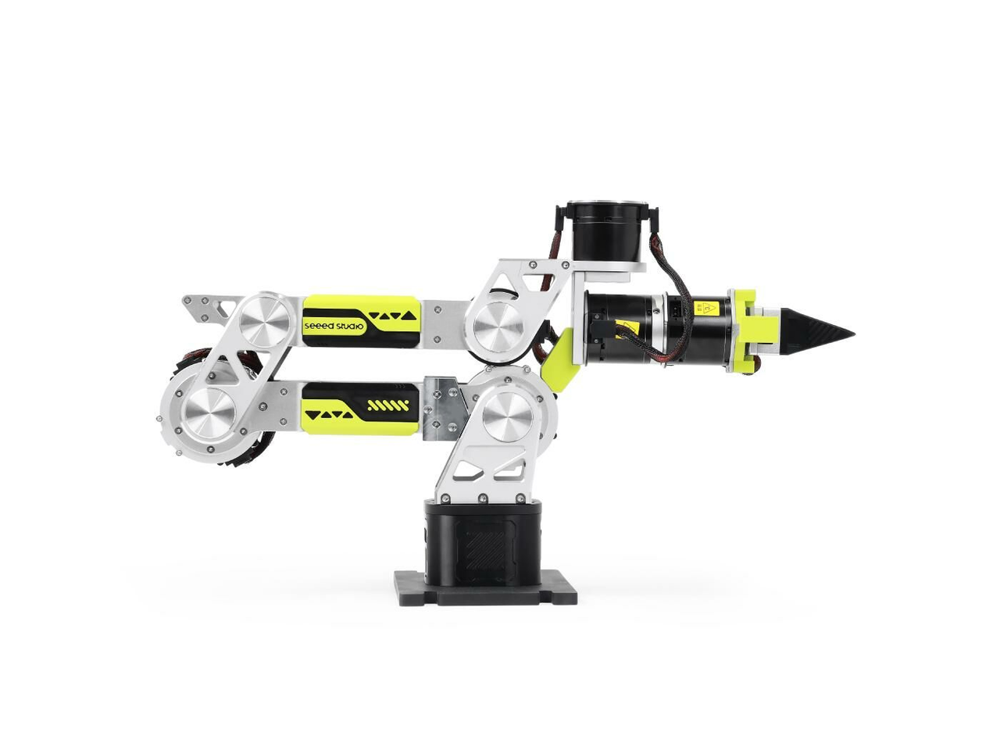

# Course Overview

Seeed Studio collaborates with NVIDIA to introduce a new hands-on curriculum for developers: from robot demonstrations and simulation to VLA post-training and real-world deployment.

Seeed Studio 携手 NVIDIA，为开发者推出全新实战课程，涵盖机器人遥操作、仿真开发、VLA 策略后训练到真实世界部署，打造从仿真到现实的完整开发实践课程。

This course focuses on the complete development workflow of the reBot Arm B601 RS robotic arm. It guides learners through hardware setup, data collection, model training, simulation validation, and finally deployment and inference on a real robotic arm. By combining LeRobot, NVIDIA Isaac Sim, GR00T 1.7, and Jetson edge AI devices, this course helps build a complete experimental environment for robot learning and embodied AI applications.

Through this course, learners will understand how to collect robotic arm data via teleoperation, how to perform data augmentation and policy training in a simulation environment, how to evaluate the performance of the trained model, and how to deploy the model on a Jetson device to execute tasks from simulation to a real robotic arm.

For demonstration purposes, this course uses a simple stationery pick-and-place task as an example. You can adjust the target task according to your own environment and requirements.

This course does not only focus on training and running a single model. More importantly, it emphasizes how to build a reproducible and extensible robotic experimental platform, laying a solid foundation for developing more robotic tasks in the future.