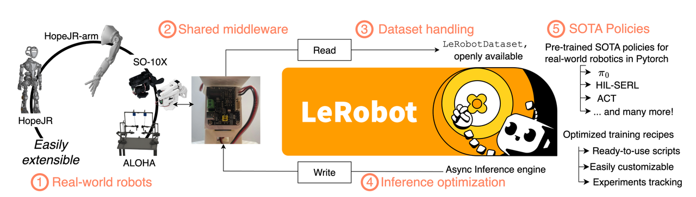

# LeRobot Background and the Community

## What is LeRobot?

LeRobot is an open-source robotics framework developed by Hugging Face. It provides a unified set of tools for robot data collection, policy training, deployment, and evaluation.

## Why LeRobot?

This course uses LeRobot as its primary software framework because it provides a complete robot learning pipeline.

LeRobot integrates closely with the Hugging Face Hub, making it easy to store, share, and reuse datasets. Community datasets can be downloaded directly for training, while newly collected demonstrations can be uploaded and shared with collaborators.

The framework also supports modern robot learning methods, including NVIDIA Isaac GR00T and other Vision-Language-Action models. The same tools used for data collection can later be used for policy training, deployment, and evaluation.

As a result, the entire workflow follows a simple cycle:

**Collect → Train → Deploy → Evaluate → Iterate**

This allows developers to focus on robotics problems rather than infrastructure.

## Community Resources

One of the strengths of LeRobot is its growing ecosystem of community resources.

The Hugging Face Hub hosts a large collection of robot datasets covering different robot platforms and manipulation tasks. These datasets follow a standardized format, making them easier to share and reuse across projects.

LeRobot also provides tools such as the Dataset Visualizer, which allows users to inspect demonstrations, replay trajectories, and analyze robot observations before training.

Together, these resources lower the barrier to entry for robot learning and accelerate experimentation.

## Getting Ready for the Course

Throughout this learning path, LeRobot will serve as the software foundation for data collection, policy training, and real-world deployment on the reBot B601 RS Arm.

Before moving on, we recommend reviewing the official LeRobot documentation and completing the environment setup tutorial. Once the software environment is ready, we can begin building the complete 具身智能 workflow in the following chapters.

## More Resources

- [LeRobot Documentation](https://huggingface.co/docs/lerobot)
- [Getting Started with reBot Arm B601-RS in LeRobot | Seeed Studio Wiki](https://wiki.seeedstudio.com/rebot_arm_b601_rs_lerobot/)
