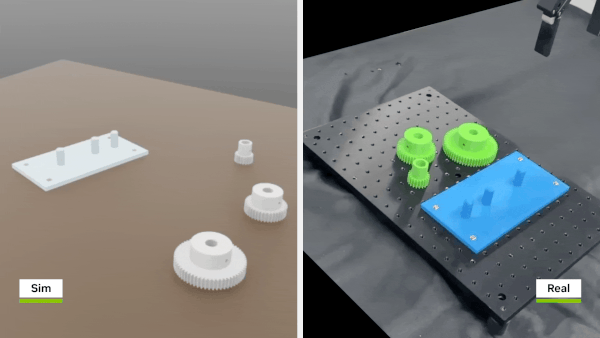

# What is Sim-to-Real?

*Image Source: [NVIDIA Developer Blog](https://developer.nvidia.com/blog/bridging-the-sim-to-real-gap-for-industrial-robotic-assembly-applications-using-nvidia-isaac-lab/)*

## Sim-to-Real Defined

Sim-to-Real (Simulation-to-Reality) refers to the process of training a robot policy in simulation and deploying it onto real-world hardware.

In modern robotics AI, a large portion of training is often performed in simulation. Compared with real robots, simulation can generate large amounts of data at a much lower cost, while avoiding hardware wear and reducing experimental risks. Once training is complete, the goal is to transfer the learned policy to a physical robot and have it perform the same task successfully in the real world.

Throughout this learning path, we will use NVIDIA Isaac simulation environments, combine teleoperation and synthetic data, train Vision-Language-Action (VLA) models such as Isaac GR00T, and ultimately deploy the trained policies onto the reBot B601 RS Arm.

## Why Sim-to-Real Matters

Data is the foundation of robot learning, but collecting large-scale real-world robot data is often expensive and time-consuming.

Consider a manipulation task that requires tens of thousands of demonstrations or grasping attempts. Collecting this data on a physical robot could take weeks, introduce hardware wear, and increase the risk of failures that may damage the robot or its environment. In simulation, however, many virtual robots can run in parallel, generating data continuously and safely.

For this reason, simulation has become a key component of modern robotics development. Many state-of-the-art robot policies are first trained in simulation before being transferred to real hardware.

The robot itself also plays an important role in successful transfer. The more precise and predictable a robot's behavior is, the smaller the difference between simulation and reality becomes. Compared with many educational robotic arms, the reBot B601 RS provides higher precision joint control and a more rigid mechanical structure, making it a strong platform for sim-to-real learning and deployment.

## The Sim-to-Real Gap

Although simulation technology has advanced significantly, it can never perfectly reproduce the real world.

The performance difference between simulation and reality is known as the **Sim-to-Real Gap**.

For example, simulated cameras often do not capture the full effects of lighting variation, motion blur, lens distortion, or sensor noise. Similarly, simulated actuators are usually more idealized than real motors, which experience friction, latency, and other physical limitations. Contact interactions, deformable objects, and environmental variations are also difficult to model accurately.

As a result, a policy that performs perfectly in simulation may still struggle when deployed on a real robot.

Reducing the sim-to-real gap is one of the central challenges in robotics AI. Throughout this course, we will explore practical techniques such as teleoperation data collection, simulation-based data generation, and GR00T-based policy training to improve real-world performance.

## Summary

Sim-to-Real is a core workflow in modern robotics AI. It enables robots to learn efficiently in simulation and apply those skills in the physical world.

While simulation dramatically reduces the cost of training and experimentation, differences between simulation and reality always exist. Understanding these differences—and learning how to minimize them—is an essential step toward building reliable and capable robotic systems.
