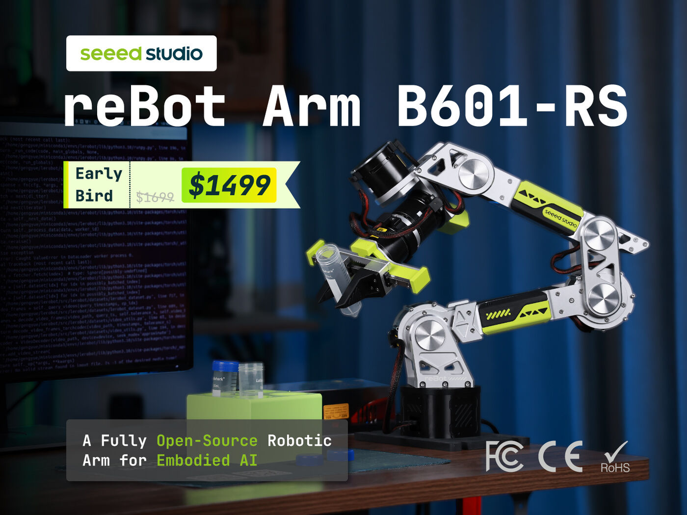
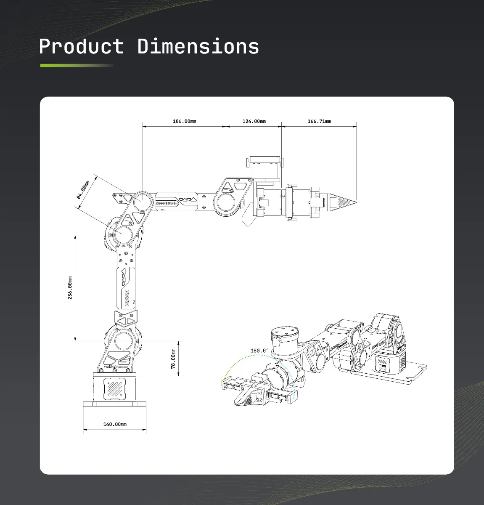
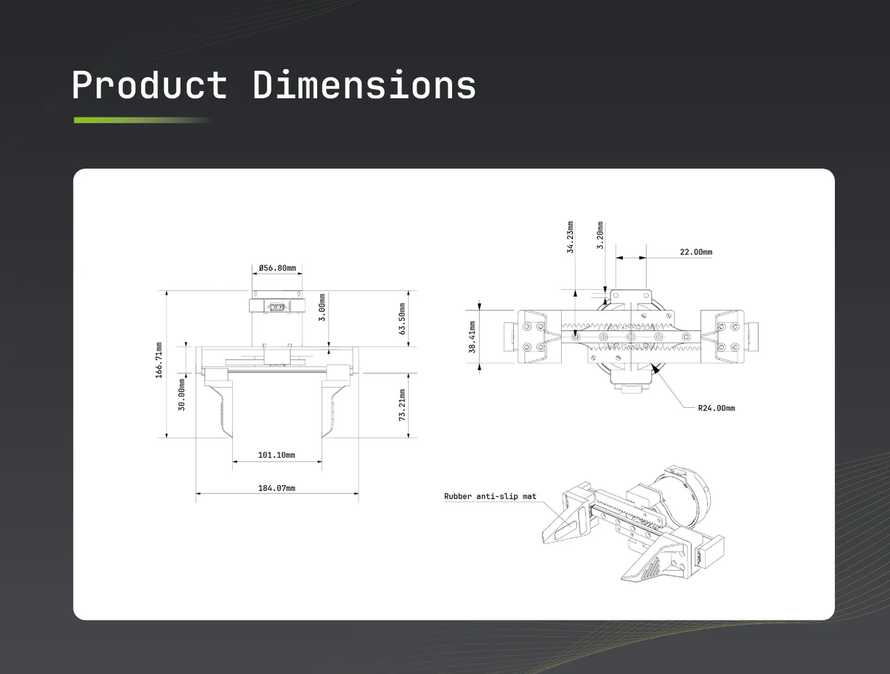

# Introduction of reBot Arm B601 RS

## Introduction

This is a low-cost 6+1-degree-of-freedom open-source robotic arm, built around the concept of 'truly open-source' and based on the Robstride Dynamics series motors, aimed at lowering the barrier to 具身智能 sim-to-real learning. Its appearance and all open-source files (including hardware blueprints, detailed BOM lists, Python SDK, and software compatible with mainstream tools such as ROS1/2) are totally available for free to individual developers, students, and educational institutions.

## Hardware Specifications

reBot-DevArm is designed for desktop Embodied AI applications, balancing payload capacity with flexibility.

| Parameter | reBot Arm B601-RS |
|---|---|
| Degrees of Freedom | **6+1** |
| Max Reach | 754mm |
| Payload | 2.5kg |
| Maximum load | 5kg |
| Weight | 6.5 kg |
| Repeatability | < 0.1 mm |
| Servos | ROBSTRIDE 06 *3 ROBSTRIDE 00 *4 |
| Operating Temperature | -20°~50° |
| Power | 48V 15A |
| Supported Platforms / Ecosystems | ROS, Moveit1, Moveit2, LeRobot, Pinocchio, Isaac Sim |

## Hardware Overview

## Applications

### Industrial Automation
With a repeatability of ±0.1 mm, the reBot Arm B601-RS is well-suited for precision manufacturing, assembly, and inspection tasks. It can reliably perform fine operations such as component insertion or screw driving on automated production lines. The compact and lightweight design also allows for quick integration into existing industrial workcells without major reconfiguration.

### Logistics & Material Handling
Featuring a rated payload of 2.5 kg and a maximum payload of 5 kg, the reBot Arm B601-RS supports gripping, transferring, and heavier handling operations. It can be deployed for sorting and palletizing tasks in warehouse or conveyor belt environments, reducing repetitive manual labor. The arm's compact form factor enables flexible operation in narrow storage aisles or between transfer stations.

### Teleoperation & 具身智能 Development
Compatible with robot learning frameworks such as Hugging Face LeRobot, NVIDIA Isaac Sim, the reBot Arm B601-RS enables remote robot control, data collection, and AI models/policies training & deployment pipeline. It serves as a dexterous "hand" unit for 具身智能 systems, recording action and force feedback data for robot reinforcement learning and understanding the dynamics via world models. This open ecosystem lowers the barrier for algorithm validation, helping developers transfer policies from simulation to real-world deployment.

### Research & Laboratory Automation
High-precision and repeatable movements make the reBot Arm B601-RS ideal for tasks such as liquid handling, sample transfer, and experimental workflow automation. Its smooth and compliant motion control allows delicate manipulation of fragile samples like biological tissues or microfluidic chips. Open software and hardware interfaces enable researchers to customize experimental procedures and accelerate prototype validation in fields like drug screening or materials testing.

## Resources

- [Getting Started Guide](https://wiki.seeedstudio.com/rebot_b601_rs_getting_started/)
- [LeRobot Integration](https://wiki.seeedstudio.com/rebot_arm_b601_rs_lerobot/)
- [Grasping Demo](https://wiki.seeedstudio.com/rebot_arm_b601_rs_grasping_demo/)
- [ROS2 Integration](https://wiki.seeedstudio.com/rebot_arm_b601_rs_ros2_integration/)
- [Pinocchio Meshcat Demo](https://wiki.seeedstudio.com/rebot_arm_b601_rs_pinocchio_meshcat/)
