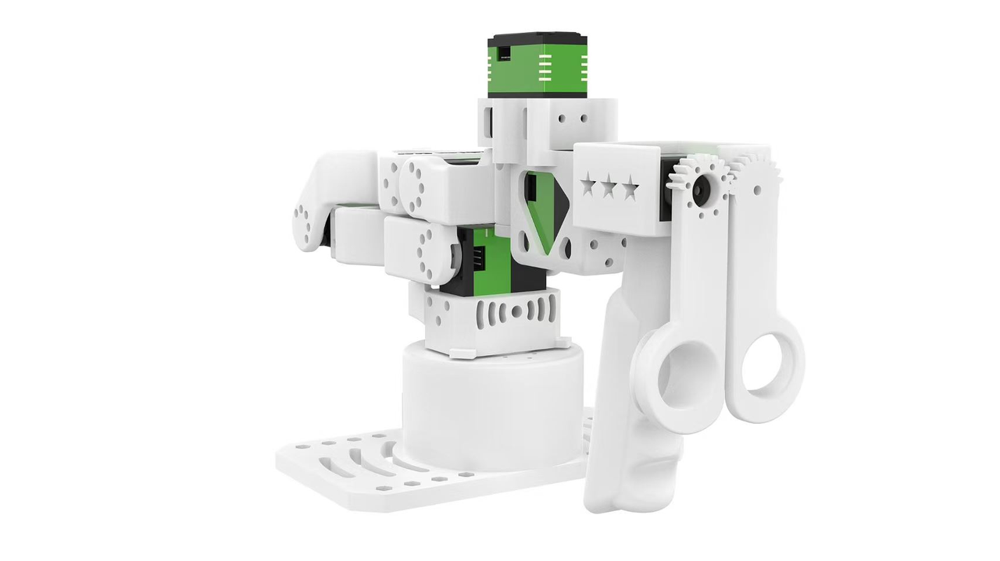
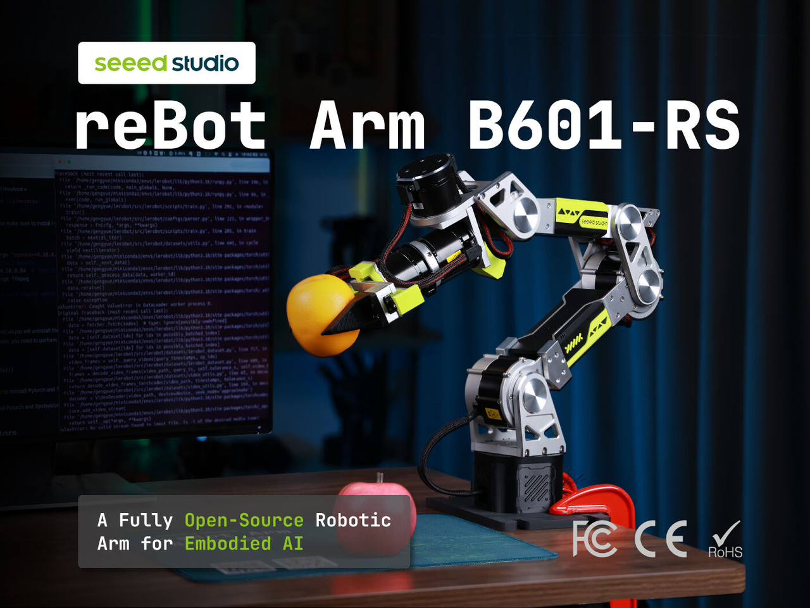
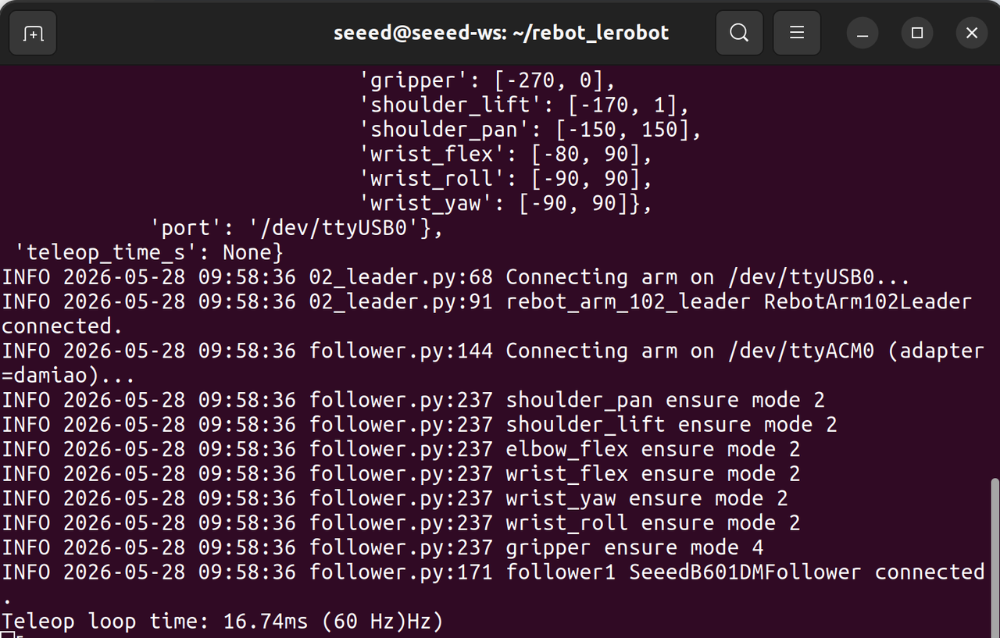

# Prepare Robot Arm

This article will introduce how to prepare the robotic arms required for subsequent experiments and briefly verify their functionality. The following sections will involve two robotic arms: a high-power slave arm and a master arm used to teleoperate the slave arm.

## Learning Objectives

- Get familiar with the robotic arms used in subsequent experiments.
- Configure and calibrate the robotic arms.
- Teleoperate the slave arm using the master arm.

## Robot Arm

### Leader Arm

It is a low-cost, open-source robotic arm designed for education and research, available as both a complete unit and a DIY kit. Featuring 6+1 degrees of freedom and adhering to the Pieper criterion, it supports analytical inverse kinematics with transparent algorithms. Fully compatible with ROS2 and LeRobot ecosystems, it enables seamless development from simulation to physical deployment across bare-metal and multi-platform environments, making it ideal for academic teaching, scientific experiments, and personal projects.



[Star Arm 102 Product Link](https://www.seeedstudio.com/Star-Arm-102-p-6765.html)

### Follower Arm

Built to be truly open. Featuring a 2.5 kg rated payload and ±0.1 mm repeatability, the reBot Arm B601-RS combines fully open hardware and software with comprehensive tutorials, making sim-to-real learning, teleoperation, and real-world robotics development more accessible than ever.



Product Link: [reBot Arm B601-RS Assembled Bundle](https://www.seeedstudio.com/reBot-Arm-B601-RS-Bundle-p-6898.html)

### Assemble the Follower arm

If you purchased a fully assembled robotic arm, please skip the first step and proceed with the Calibration section.

<iframe width="100%" height="420" src="https://www.youtube.com/embed/rfTQoFCfnMc" title="Assemble the Follower arm" frameborder="0" allow="accelerometer; autoplay; clipboard-write; encrypted-media; gyroscope; picture-in-picture" allowfullscreen style="border-radius: 8px; margin: 1rem 0; width: 100%;"></iframe>

### Reset Motors ID

#### Hardware Components

- [reBot Arm B601 DM Robotic Arm × 1](https://www.seeedstudio.com/reBot-Arm-B601-DM-Bundle.html)
- [USB-CAN Adapter Board × 1](https://www.seeedstudio.com/DM-CAN-USB-Driver-Borad-p-6706.html)
- [Signal-Power Separation Board × 1](https://www.seeedstudio.com/XT30-2-2-Power-Separation-Board-p-6707.html)
- Woodworking Clamps × 2
- USB-C Cable × 1
- [24V 15A Power Supply (XT30 output) × 1](https://www.seeedstudio.com/AC-DC-Power-Adapter-IEC-60320-C14-XT30-Female-24V-4-5A-1200mm-L190-W92-5-H36mm-p-6764.html)
- [Power Cord-US](https://www.seeedstudio.com/reServer-AC-US-p-5052.html) \ [Power Cord-EU](https://www.seeedstudio.com/seeedstudio-reServer-AC-EU-p-5051.html)
- Dual-boot personal computer (Windows + Ubuntu / macOS)

.PNG)

#### Software

Please install the DM motor PC software on your computer (Windows system).

[DM_Tools_v.1.8.0.1.exe (Supports Windows Only)](https://files.seeedstudio.com/wiki/robotics/projects/rebot_arm/DM_Tools_v1.8.0.1.exe)

#### Configure Motors

Follow the steps shown in the video to configure each motor one by one.

## Calibration reBot Arm

After completing the motor setup, we need to perform an overall calibration of the robotic arm. Since we will be using the LeRobot codebase to collect VLA datasets in subsequent steps, we will use LeRobot for this calibration process.

### Download and Install the LeRobot Code

Execute the following commands in a terminal window on your PC (Linux):

```bash
mkdir ~/rebot_lerobot
cd ~/rebot_lerobot
sudo apt update
sudo apt install -y ffmpeg

# Download github repo
git clone https://github.com/Seeed-Projects/lerobot.git
git clone https://github.com/Seeed-Projects/lerobot-teleoperator-rebot-arm-102.git
git clone https://github.com/Seeed-Projects/lerobot-robot-seeed-b601.git

# Create virtual environment (Python 3.12)
uv venv --python 3.12 .venv

# Activate environment
source .venv/bin/activate

# Upgrade pip (optional)
uv pip install --upgrade pip

# Install lerobot main project (editable mode)
uv pip install -e ./lerobot

# Add local dependency packages (editable install)
uv pip install -e ./lerobot-teleoperator-rebot-arm-102
uv pip install -e ./lerobot-robot-seeed-b601
uv pip install motorbridge
```

### Configure Serial Port Permissions

```bash
# Leader
sudo chmod 666 /dev/ttyUSB*
# Follower
sudo ip link set can0 down 2>/dev/null
sudo ip link set can0 type can bitrate 1000000 restart-ms 100
sudo ip link set can0 up
```

### Calibrate the Robotic Arm

Execute the following two commands in a terminal window on your PC to calibrate the robotic arm.

- **Follower Arm**

```bash
lerobot-calibrate \
    --robot.type=seeed_b601_rs_follower \
    --robot.port=can0 \
    --robot.id=follower1 \
    --robot.can_adapter=socketcan
```

*Execution Log (SocketCAN Adapter):*

```text
(.venv) seeed@seeed-ws:~/rebot_lerobot$ lerobot-calibrate \
    --robot.type=seeed_b601_rs_follower \
    --robot.port=can0 \
    --robot.id=follower1 \
    --robot.can_adapter=socketcan
INFO 2026-07-28 13:55:29 calibrate.py:81 {'robot': {'calibration_dir': None,
           'cameras': {},
           'can_adapter': 'socketcan',
           'disable_torque_on_disconnect': True,
           'dm_serial_baud': 921600,
           'force_pos_torque_ration': 0.1,
           'gripper_mit_kd': 0.05,
           'gripper_mit_kp': 12.0,
           'gripper_mit_torque_limit': 8.0,
           'id': 'follower1',
           'joint_directions': {'elbow_flex': -1.0,
                                'gripper': 6.0,
                                'shoulder_lift': 1.0,
                                'shoulder_pan': 1.0,
                                'wrist_flex': -1.0,
                                'wrist_roll': 1.0,
                                'wrist_yaw': -1.0},
           'joint_limits': {'elbow_flex': (-0.0, 200.0),
                            'gripper': (-0.0, 270.0),
                            'shoulder_lift': (-0.0, 170.0),
                            'shoulder_pan': (-145.0, 145.0),
                            'wrist_flex': (-80.0, 90.0),
                            'wrist_roll': (-90.0, 90.0),
                            'wrist_yaw': (-90.0, 90.0)},
           'max_relative_target': None,
           'mit_kd': {'elbow_flex': 10.0,
                      'shoulder_lift': 10.0,
                      'shoulder_pan': 3.0,
                      'wrist_flex': 5.0,
                      'wrist_roll': 4.0,
                      'wrist_yaw': 4.0},
           'mit_kp': {'elbow_flex': 150.0,
                      'shoulder_lift': 150.0,
                      'shoulder_pan': 50.0,
                      'wrist_flex': 50.0,
                      'wrist_roll': 50.0,
                      'wrist_yaw': 50.0},
           'motor_can_ids': {'elbow_flex': (3, 253),
                             'gripper': (7, 253),
                             'shoulder_lift': (2, 253),
                             'shoulder_pan': (1, 253),
                             'wrist_flex': (4, 253),
                             'wrist_roll': (6, 253),
                             'wrist_yaw': (5, 253)},
           'port': 'can0',
           'pos_vel_velocity': [50, 0.4, 0.4, 50, 50, 50, 0]},
 'teleop': None}
INFO 2026-07-28 13:55:29 follower.py:129 Connecting arm on can0 (adapter=socketcan)...
INFO 2026-07-28 13:55:29 follower.py:223 shoulder_pan ensure mode 1
INFO 2026-07-28 13:55:29 follower.py:223 shoulder_lift ensure mode 1
INFO 2026-07-28 13:55:29 follower.py:223 elbow_flex ensure mode 1
INFO 2026-07-28 13:55:29 follower.py:223 wrist_flex ensure mode 1
INFO 2026-07-28 13:55:29 follower.py:223 wrist_yaw ensure mode 1
INFO 2026-07-28 13:55:29 follower.py:223 wrist_roll ensure mode 1
INFO 2026-07-28 13:55:29 follower.py:223 gripper ensure mode 1
INFO 2026-07-28 13:55:29 follower.py:156 follower1 SeeedB601RSFollower connected.
Press ENTER to use provided calibration file associated with the id follower1, or type 'c' and press ENTER to recalculate calibration
INFO 2026-07-28 13:55:38 follower.py:170 Using calibration file associated with the id follower1
INFO 2026-07-28 13:55:38 follower.py:390 follower1 SeeedB601RSFollower disconnected.
```

- **Leader Arm**

```bash
lerobot-calibrate \
    --teleop.type=rebot_arm_102_leader \
    --teleop.port=/dev/ttyUSB0 \
    --teleop.id=rebot_arm_102_leader
```

*Alternative Command & Log (Damiao USB-CAN Adapter):*

```bash
(.venv) seeed@seeed-ws:~/rebot_lerobot$ lerobot-calibrate \
    --robot.type=seeed_b601_dm_follower \
    --robot.port=/dev/ttyACM0 \
    --robot.id=follower1 \
    --robot.can_adapter=damiao
INFO 2026-05-28 09:35:39 calibrate.py:81 {'robot': {'calibration_dir': None,
           'cameras': {},
           'can_adapter': 'damiao',
           'disable_torque_on_disconnect': True,
           'dm_serial_baud': 921600,
           'force_pos_torque_ration': 0.1,
           'id': 'follower1',
           'joint_limits': {'elbow_flex': (-200.0, 1.0),
                            'gripper': (-270.0, 0.0),
                            'shoulder_lift': (-170.0, 1.0),
                            'shoulder_pan': (-145.0, 145.0),
                            'wrist_flex': (-80.0, 90.0),
                            'wrist_roll': (-90.0, 90.0),
                            'wrist_yaw': (-90.0, 90.0)},
           'max_relative_target': None,
           'motor_can_ids': {'elbow_flex': (3, 19),
                             'gripper': (7, 23),
                             'shoulder_lift': (2, 18),
                             'shoulder_pan': (1, 17),
                             'wrist_flex': (4, 20),
                             'wrist_roll': (6, 22),
                             'wrist_yaw': (5, 21)},
           'port': '/dev/ttyACM0',
           'pos_vel_velocity': [150, 150, 150, 150, 150, 150, 150]},
 'teleop': None}
INFO 2026-05-28 09:35:39 follower.py:144 Connecting arm on /dev/ttyACM0 (adapter=damiao)...
INFO 2026-05-28 09:35:39 follower.py:237 shoulder_pan ensure mode 2
INFO 2026-05-28 09:35:39 follower.py:237 shoulder_lift ensure mode 2
INFO 2026-05-28 09:35:39 follower.py:237 elbow_flex ensure mode 2
INFO 2026-05-28 09:35:39 follower.py:237 wrist_flex ensure mode 2
INFO 2026-05-28 09:35:39 follower.py:237 wrist_yaw ensure mode 2
INFO 2026-05-28 09:35:39 follower.py:237 wrist_roll ensure mode 2
INFO 2026-05-28 09:35:39 follower.py:237 gripper ensure mode 4
INFO 2026-05-28 09:35:39 follower.py:171 follower1 SeeedB601DMFollower connected.
INFO 2026-05-28 09:35:39 follower.py:188 
Running calibration for follower1 SeeedB601DMFollower

Calibration: Set Zero Position
Please MANUALLY move the robot to its ZERO POSITION, and close its gripper.
Reference the B601 manual for Zero Pose (generally the default sit-down position).

Press ENTER when ready...
INFO 2026-05-28 09:35:52 follower.py:203 Arm zero position set.
INFO 2026-05-28 09:35:52 follower.py:205 Setting range: -90° to +90° by default for all joints
Calibration saved to /home/seeed/.cache/huggingface/lerobot/calibration/robots/seeed_b601_dm_follower/follower1.json
INFO 2026-05-28 09:35:52 follower.py:372 follower1 SeeedB601DMFollower disconnected.
```

> [!WARNING]
> After execution, wait for calibration to complete, then press Enter as prompted by the terminal.

## Verify the Robotic Arm

Finally, we can verify the robotic arm using teleoperation commands.

Run the following command in the PC terminal to start teleoperation.

```bash
lerobot-teleoperate \
    --robot.type=seeed_b601_rs_follower \
    --robot.port=can0 \
    --robot.id=follower1 \
    --robot.can_adapter=socketcan \
    --teleop.type=rebot_arm_102_leader \
    --teleop.port=/dev/ttyUSB0 \
    --teleop.id=rebot_arm_102_leader
```

*Terminal Output:*



You can now use the master arm to remotely control the slave arm.

