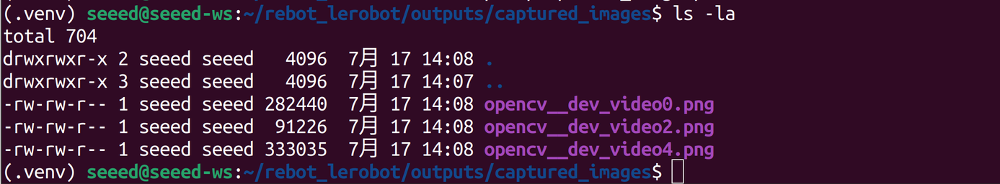
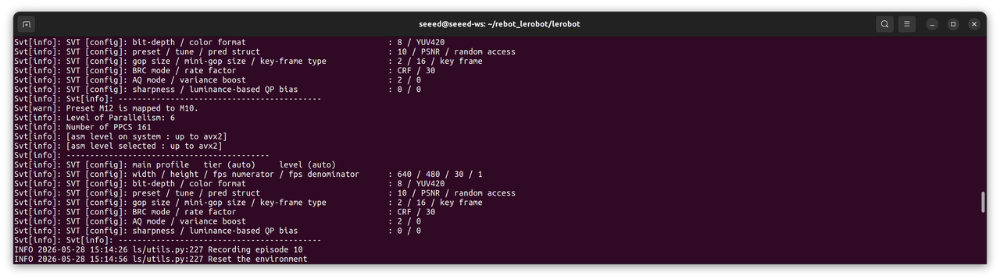
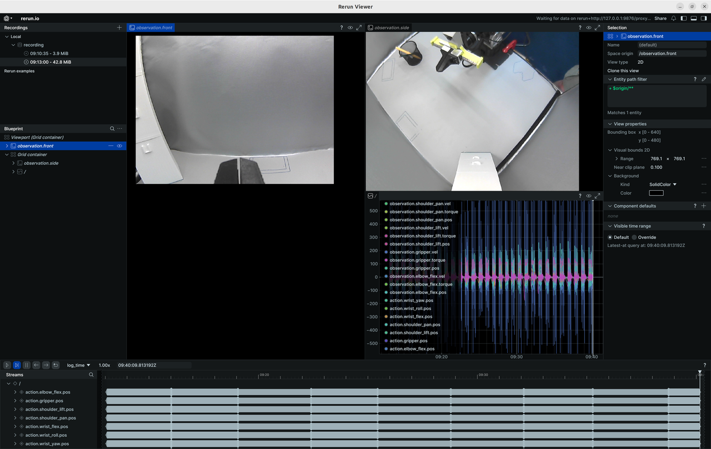
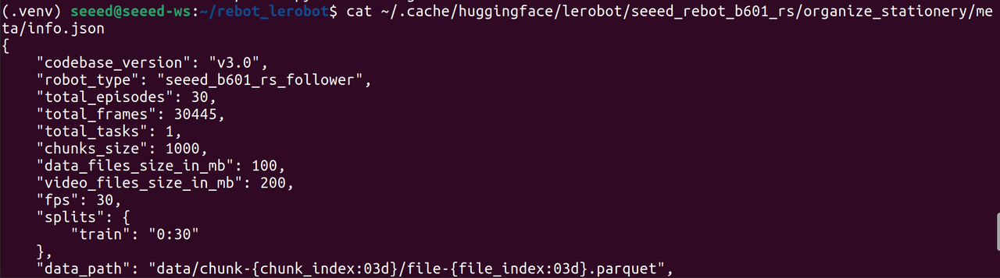

# Collect Data from Real Env

This article will guide you through collecting the training dataset required for GR00T. Before getting started, please ensure that `lerobot` is installed on your system.

## Learning Objectives

- Understand the basic usage of the lerobot data collection script.
- Generate a complete `VLA` training dataset.

## Prepare the code and runtime environment

Open a terminal and execute:

```bash
mkdir ~/rebot_lerobot
cd ~/rebot_lerobot
sudo apt update
sudo apt install -y ffmpeg

# Download github repo
git clone https://github.com/Seeed-Projects/lerobot.git
git clone https://github.com/Seeed-Projects/lerobot-teleoperator-rebot-arm-102.git
git clone https://github.com/Seeed-Projects/lerobot-robot-seeed-b601.git

# Create virtual environment (Python 3.12)
uv venv --python 3.12 .venv

# Activate environment
source .venv/bin/activate

# Upgrade pip (optional)
uv pip install --upgrade pip

# Install lerobot main project (editable mode)
uv pip install -e ./lerobot

# Add local dependency packages (editable install)
uv pip install -e ./lerobot-teleoperator-rebot-arm-102
uv pip install -e ./lerobot-robot-seeed-b601
uv pip install motorbridge
```

> [!NOTE]
> The runtime environment only needs to be configured once. If you have previously set up the environment, you can quickly enter the workspace and activate the virtual environment by running:  
> `cd ~/rebot_lerobot && source .venv/bin/activate`

## Test the camera

If you are unsure of the camera ID, use the camera detection and preview tool provided by LeRobot to check which cameras are available on your computer and find their corresponding IDs. Please enter the `lerobot-find-camera` command in the terminal. After the program finishes executing, you can find the preview images in `~/rebot_lerobot/outputs/captured_images` folder.

The naming convention for the preview images is: `<lowercase_camera_type>_dev_<camera_id>.png`.



You can determine the camera device ID based on the preview image filename. For example, a preview image named `opencv_0.png` corresponds to the device: `/dev/video0`.

> [!WARNING]
> Note that the `/dev/videoX` index may change after reconnecting a USB camera or rebooting the device. Therefore, it is recommended to run `lerobot-find-cameras` once before data collection to verify the current camera IDs.

## Start the data collection program

First grant permissions to the serial ports:

```bash
# Leader
sudo chmod 666 /dev/ttyUSB*
# Follower
sudo ip link set can0 down 2>/dev/null
sudo ip link set can0 type can bitrate 1000000 restart-ms 100
sudo ip link set can0 up
```

Then start data collection:

```bash
# Save Dataset Locally
lerobot-record \
    --robot.type=seeed_b601_rs_follower \
    --robot.port=can0 \
    --robot.id=follower1 \
    --robot.can_adapter=socketcan \
    --robot.cameras="{ front: {type: opencv, index_or_path: 6, width: 640, height: 480, fps: 30} }" \
    --teleop.type=rebot_arm_102_leader \
    --teleop.port=/dev/ttyUSB0 \
    --teleop.id=rebot_arm_102_leader \
    --display_data=true \
    --dataset.repo_id=seeed_rebot_b601_rs/organize_stationery \
    --dataset.num_episodes=100 \
    --dataset.single_task="Organize stationery" \
    --dataset.push_to_hub=false \
    --dataset.episode_time_s=25 \
    --dataset.reset_time_s=5
```

> [!CAUTION]
> During teleoperation, if the master-slave robotic arm experiences power disconnection, poor power contact, or signal line detachment, you must first stop the program code and return the robotic arm to its home zero position. Only then reconnect the power supply and restart the program. This prevents data disorder from causing robotic arm runaway and potential safety hazards.

> [!CAUTION]
> Please ensure that you have configured the access permissions for the robotic arm port.

> [!WARNING]
> Please ensure that you have entered the correct camera parameters.

The `record` function of lerobot provides a suite of tools for capturing and managing data during robot operation.

### 1. Data Storage

- Data is stored using the `LeRobotDataset` format and is stored on disk during recording.
- By default, the dataset is pushed to your Hugging Face page after recording.
- To disable uploading, use: `--dataset.push_to_hub=False`.

### 2. Checkpointing and Resuming

- Checkpoints are automatically created during recording.
- To resume after an interruption, re-run the same command with: `--resume=true`.
- To start recording from scratch, manually delete the dataset directory.

> [!WARNING]
> When resuming, set `--dataset.num_episodes` to the number of additional episodes to record (not the targeted total number of episodes in the dataset).

### 3. Recording Parameters

Set the flow of data recording using command-line arguments:

| Parameter | Description | Default |
|---|---|---|
| `--dataset.episode_time_s` | Duration per data episode (seconds) | 60 |
| `--dataset.reset_time_s` | Environment reset time after each episode (seconds) | 60 |
| `--dataset.num_episodes` | Total episodes to record | 50 |

### 4. Keyboard Controls During Recording

Control the data recording flow using keyboard shortcuts:

| Key | Action |
|---|---|
| `→` (Right Arrow) | Early-stop current episode/reset; move to next. |
| `←` (Left Arrow) | Cancel current episode; re-record it. |
| `ESC` | Stop session immediately, encode videos, and upload dataset. |

If your keyboard presses are not responding, you may need to downgrade your pynput version, such as installing version 1.6.8.

```bash
pip install pynput==1.6.8
```

## To collect data via teleoperation:

After the data collection script is started, please follow the prompts in the terminal log to complete the data collection.





## Organize the dataset.

The collected data will be saved in the local `~/.cache/huggingface/lerobot` directory.



Now, you have successfully collected a VLA dataset using LeRobot.
