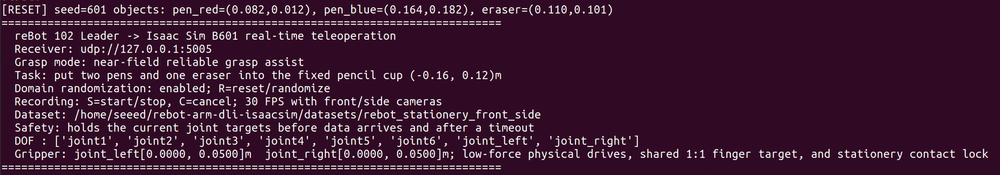
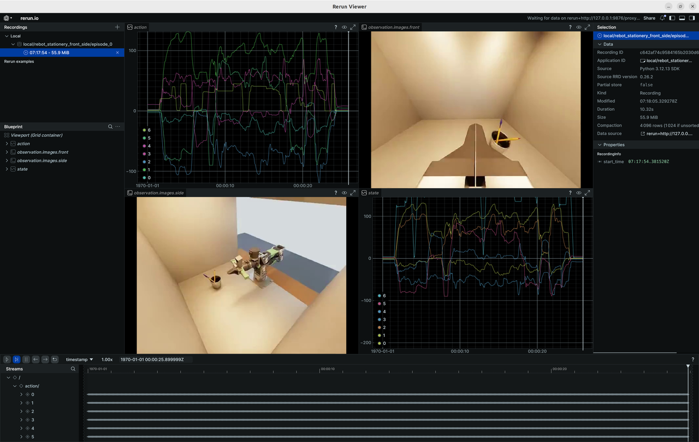

# Collect Data from Isaac Sim

This article describes how to use the reBot Arm 102 Leader to control the B601 robotic arm in Isaac Sim in real time, and collect the human demonstration of "stationery organization" into the LeRobot Dataset v3 dataset.

> [!NOTE]
> The simulation dataset is optional.


## Learning Objectives

- Learn about the Nvidia Isaac Sim simulation tool
- Generate a complete `VLA` training dataset

## Data Acquisition Process

The data link of this project is as follows:

```text
reBot Arm 102 Leader
       | USB-UART
       ▼
LeRobot Python bridge -- UDP 127.0.0.1:5005 --> Isaac Sim B601
                                                        |
                                   +--------------------+--------------------+
                                   |                    |                    |
                                   ▼                    ▼                    ▼
                              action/state         front camera         side camera
                                   |                    |                    |
                                   +--------------------+--------------------+
                                                        |
                                                        ▼
                                                 LeRobot Dataset v3
```

The `Leader` only provides manual control commands, and the simulated robotic arm will not autonomously execute the grasping trajectory. The system simultaneously records:

- `action`: 6 joint and gripper commands for the `Leader`;
- `observation.state`: the states of the 6 joints and the gripper of simulation B601;
- `observation.images.front`: camera images that move along with the wrist;
- `observation.images.side`: the image captured by the fixed side-view camera inside the enclosure;
- Task text, randomization parameters, and task success status.

The default acquisition frequency is 30 `FPS`. Both cameras have a resolution of 640 × 480.

## Environmental Requirements

Please confirm the following before starting:

- Ubuntu 22.04;
- NVIDIA RTX GPU and a properly launchable Isaac Sim 4.5;
- Isaac Sim is installed by default at `~/isaacsim`;
- The LeRobot environment is located at `~/rebot_lerobot/.venv`;
- The reBot Arm 102 Leader has been connected to the computer via USB-UART and calibrated successfully.

The recommended directory structure is as follows:

```text
~
├── isaacsim/
└── rebot_lerobot/
    └── .venv/bin/python
```

## Download Source Code

Run the following command in the terminal of the Ubuntu host:

```bash
cd ~
git clone https://github.com/yuyoujiang/rebot-arm-dli-isaacsim.git
```

## Launch Isaac Sim Teleoperation

Navigate to the project directory and start:

```bash
cd ~/rebot-arm-dli-isaacsim
./run.sh --leader-port /dev/ttyUSB0
```

If there is only one `/dev/ttyUSB*` device, you can also let the program detect it automatically:

```bash
./run.sh
```

If Isaac Sim is installed in a different directory:

```bash
ISAACSIM_ROOT=/path/to/isaacsim ./run.sh --leader-port /dev/ttyUSB0
```

After startup is complete, the terminal shall display:



## Capture an episode

Ensure that the Isaac Sim viewport has obtained keyboard focus, then performs the following operations in sequence:

1. Press `R` to reset the scene. The two pens and eraser will be repositioned, and randomization of objects, lighting, and the `front` camera will be applied.
2. Check the two captured images and the initial position of the stationery.
3. Press `S` to start recording. The following should appear on the terminal:

```text
[record] Episode started at 30 FPS -> .../datasets/rebot_stationery_front_side
```

4. Operate the leader, and put the two pens and the eraser into the pen holder in sequence.
5. Release the gripper and wait for the object to stabilize inside the pen holder.
6. When `[SUCCESS]` appears on the terminal, press `S` to finish and save the episode.
7. Wait for the background encoding to complete until the following message appears in the terminal:

```text
[dataset] Episode saved; total completed: 1
```

The system will convert temporary JPEGs, actions and states into LeRobot Dataset v3 in the background, and you can start the next operation during the encoding process. When exiting the program, if there are still pending episodes, the program will wait for the background tasks to complete.

## Keyboard Shortcuts

| button | Function |
|---|---|
| `R` | Reset the three target objects and re-randomize them |
| `S` | Start recording; press again while recording to end and save |
| `C` | Cancel the current episode without writing it to the dataset |

If an object falls, a grasp fails, the motion quality is poor, or the camera is occluded during the demonstration, press `C` to discard the current episode, then press `R` to start the next data collection.

The default output directory for collected data is:

```bash
~/rebot-arm-dli-isaacsim/datasets/rebot_stationery_front_side
```

## Inspect and visualize datasets

You can quickly inspect the collected data using the LeRobot visualization tool by running the following command in the terminal:

```bash
cd ~/rebot_lerobot
source .venv/bin/activate

lerobot-dataset-viz \
    --repo-id local/rebot_stationery_front_side \
    --root ~/rebot-arm-dli-isaacsim/datasets/rebot_stationery_front_side \
    --mode local \
    --episode-index 0 \
    --display-compressed-images false
```

Check different episodes in sequence to confirm that the actions, statuses and the time of the two video streams are synchronized, and there are no black frames, frozen frames or severe occlusion in the picture.



## Replaying Actions in Isaac Sim

First, start an Isaac Sim receiver that does not connect to the Leader, does not record data, and has randomization disabled:

```bash
cd ~/rebot-arm-dli-isaacsim
./run.sh --no-start-bridge --no-recording --no-dr
```

Then open the second terminal and play back the 0th episode:

```bash
cd ~/rebot-arm-dli-isaacsim
../rebot_lerobot/.venv/bin/python \
    scripts/replay_episode.py --episode 0
```

Loop playback can be enabled by adding `--loop`:

```bash
../rebot_lerobot/.venv/bin/python \
    scripts/replay_episode.py --episode 0 --loop
```

The replay script sends the data in the dataset `action`, which is used to check the motion trajectory of the robotic arm; it is not a dual-camera video player, and the camera content should be inspected using the LeRobot dataset visualization tool.

## Configuration and Reference Materials

Main configuration files in the project:

- `config/teleop_config.json`: serial port, UDP, joint mapping and grasping assistance;
- `config/domain_randomization.json`: object, lighting, camera and dataset parameters;
- `config/grasp_config.json`: Scene objects, physical parameters and task success conditions.

References:

- [Seeed 飞书参考文档](https://seeedstudio.feishu.cn/wiki/PDmbwRFOEiyuBEkaoG9cPYexnde?fromScene=spaceOverview)
- [Seeed Feishu Reference Documentation](https://seeedstudio.feishu.cn/wiki/PDmbwRFOEiyuBEkaoG9cPYexnde?fromScene=spaceOverview)
- [Seeed: 通过 LeIsaac 仿真 SO-ARM101](https://wiki.seeedstudio.com/cn/simulate_soarm101_by_leisaac/)
- [Seeed: Emulating SO-ARM101 via LeIsaac](https://wiki.seeedstudio.com/cn/simulate_soarm101_by_leisaac/)
- [Seeed: reBot Arm B601-RS Isaac Sim 指南](https://wiki.seeedstudio.com/cn/rebot_arm_b601_rs_isaacsim/)
- [Seeed: reBot Arm B601-RS Leader 校准](https://wiki.seeedstudio.com/rebot_arm_b601_rs_lerobot/#calibrate-the-leader-arm)

