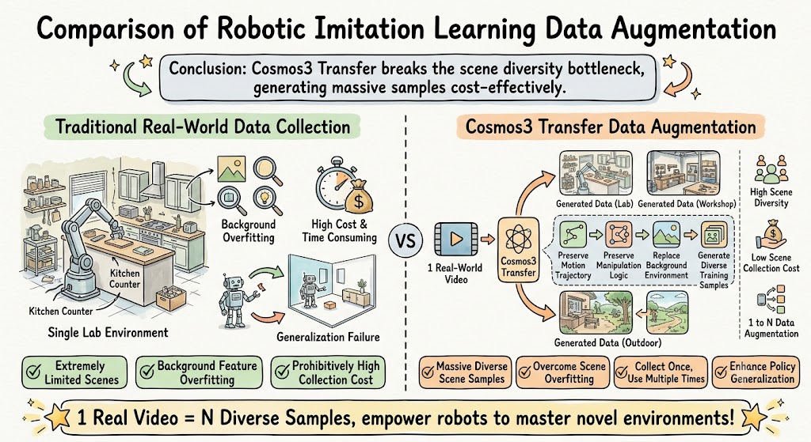
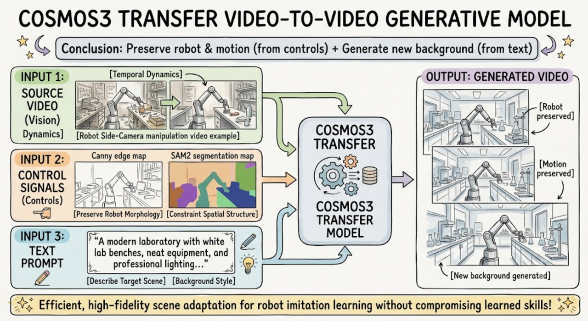
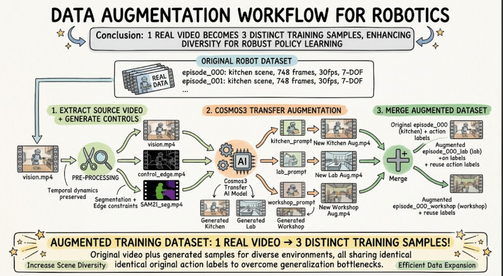

# Datasets Augment

Collecting data in real-world scenarios entails high costs and significant limitations. For instance:

- **Limited Environments**: Data is typically collected across only a few fixed scenes.
- **Background Overfitting**: Policy networks may learn background features irrelevant to the task (e.g., wall color, lighting conditions, object placement), causing the policy to fail to generalize to new environments.
- **High Collection Costs**: Each additional scene requires redeployment, recalibration, and re-collection of data.



We leverage the state-of-the-art Cosmos Transfer model to modify video scenes, expanding dataset diversity to enhance model robustness.

## Learning Objectives

- Understand the working principles of Nvidia Cosmos3 Transfer
- Generate VLA data using Cosmos3

## Introduction of Cosmos

**NVIDIA Cosmos** is a foundational AI platform designed to accelerate the development of **Physical AI** (such as robotics and autonomous vehicles). While traditional AI focuses on text and code, Cosmos is built to understand, simulate, and interact with the physical world.

## How Cosmos3 Transfer Works

Cosmos3 Transfer is a **video-to-video** generative model. It takes three inputs:

| Input | Purpose | Example |
|---|---|---|
| Source video (vision) | Provides temporal dynamic information | Robot side-camera manipulation video |
| Control signals (controls) | Constrains spatial structure, preserves robot morphology | Canny edge map + SAM2 segmentation map |
| Text prompt | Describes the target scene's appearance | "A modern laboratory with white lab benches..." |



The control signals (edges + segmentation) lock the robot's shape and motion in place. The text prompt drives what the new background looks like.

## Control Signal Overview

| Control Type | Purpose | Pre-computation Required? |
|---|---|---|
| Edge | Preserves object outlines and structure, prevents subject deformation | Optional (framework can auto-compute Canny) |
| Seg | Preserves semantic regions (robot/object/background boundaries) | Required (depends on SAM2) |
| Blur | Preserves global layout while allowing more texture variation | Optional (framework can auto-compute) |
| Depth | Preserves spatial depth relationships | Required (depends on DepthAnything) |

<div style="display: grid; grid-template-columns: repeat(auto-fit, minmax(280px, 1fr)); gap: 1.5rem; margin: 1.5rem 0;">
  <div>
    <p style="font-weight: 600; font-size: 0.9rem; margin-bottom: 0.5rem; text-align: center;">Control Edge Preview</p>
    <video controls autoplay loop muted playsinline style="width: 100%; border-radius: 8px; border: 1px solid var(--nv-border);">
      <source src="../video/control_edge.mp4" type="video/mp4">
    </video>
  </div>
  <div>
    <p style="font-weight: 600; font-size: 0.9rem; margin-bottom: 0.5rem; text-align: center;">Control Seg Preview</p>
    <video controls autoplay loop muted playsinline style="width: 100%; border-radius: 8px; border: 1px solid var(--nv-border);">
      <source src="../video/control_seg.mp4" type="video/mp4">
    </video>
  </div>
</div>

**What works well:** Edge + Seg dual control, with Edge weight dominant (0.9) so the robot doesn't warp.

## Env Setup

### Hardware Requirements

| Model | Min GPU VRAM | Recommended GPU |
|---|---|---|
| Cosmos3-Nano | ~24 GB | Single RTX 4090 / A5000 / Jetson AGX Thor |
| Cosmos3-Super | ~80 GB × 4 | 4× A100 / H100 |

### Installation

```bash
# Clone the Cosmos repository
git clone https://github.com/NVIDIA/Cosmos.git
cd Cosmos

# Navigate to the framework directory
cd packages/cosmos3

# Create a virtual environment
uv venv --python 3.13
source .venv/bin/activate

# Install dependencies
uv pip install -e ".[inference]"
```

### Download Models

```bash
# Log in to Hugging Face
huggingface-cli login

# Download Cosmos3-Nano model weights
hf download nvidia/Cosmos3-Nano --local-dir /path/to/models/Cosmos3-Nano
```

## Prepare Your Data

### Directory Structure

```text
your_project/
├── controls/
│   └── episode_000/
│       ├── vision.mp4                # Source video (robot manipulation recording)
│       ├── control_edge.mp4           # Canny edge map
│       └── control_seg.mp4            # SAM2 segmentation map
├── prompts/
│   ├── kitchen_prompt.json           # Kitchen scene prompt
│   ├── lab_prompt.json               # Lab scene prompt
│   └── workshop_prompt.json          # Workshop scene prompt
├── specs/
│   ├── my_kitchen.json               # Kitchen scene inference config
│   ├── my_lab.json                   # Lab scene inference config
│   └── my_workshop.json              # Workshop scene inference config
├── negative_prompt.json              # Negative prompt (shared)
└── outputs/                          # Generation output directory
```

### Extract Source Video

Extract a video clip from your robot dataset:

```bash
# Example: extract episode 0 side camera from grab_jetson dataset
ffmpeg -i grab_jetson/videos/chunk-000/observation.images.side/episode_000000.mp4 \
  -c copy your_project/controls/episode_000/vision.mp4
```

### Generate Control Signals

**Edge (Canny edge detection):**

```python
# Generate edge map using OpenCV or ffmpeg
python -c "
import cv2
import subprocess

# Read source video
cap = cv2.VideoCapture('your_project/controls/episode_000/vision.mp4')
fps = cap.get(cv2.CAP_PROP_FPS)
w = int(cap.get(cv2.CAP_PROP_FRAME_WIDTH))
h = int(cap.get(cv2.CAP_PROP_FRAME_HEIGHT))
n = int(cap.get(cv2.CAP_PROP_FRAME_COUNT))

# Write edge video
out = cv2.VideoWriter(
    'your_project/controls/episode_000/control_edge.mp4',
    cv2.VideoWriter_fourcc(*'avc1'), fps, (w, h), isColor=True
)

while True:
    ret, frame = cap.read()
    if not ret:
        break
    gray = cv2.cvtColor(frame, cv2.COLOR_BGR2GRAY)
    edges = cv2.Canny(gray, 50, 150)
    out.write(cv2.cvtColor(edges, cv2.COLOR_GRAY2BGR))

cap.release()
out.release()
print(f'Generated {n} frames of edge control')
"
```

**Seg (SAM2 segmentation):** Run SAM2 to segment the robot and the objects it interacts with. SAM2 is a separate install—not bundled with Cosmos.

```bash
# Install SAM2
pip install sam2

# Run segmentation (specific script depends on your SAM2 configuration)
python your_sam2_script.py \
  --input your_project/controls/episode_000/vision.mp4 \
  --output your_project/controls/episode_000/control_seg.mp4
```

### Write Prompts

Each prompt is a JSON file describing the target scene. Here are three examples:

**Kitchen scene (`prompts/kitchen_prompt.json`):**

```json
{
  "subjects": [{
    "description": "A robotic manipulator with a 6-DOF arm performing a tabletop pick-and-place task",
    "appearance_details": "Black anodized aluminum links, small two-finger gripper with rubber pads",
    "action": "grab the Jetson",
    "pose": "Arm extends toward the object, gripper closes around the object, then lifts clear",
    "state_changes": "Gripper transitions from open to closed, the held object is lifted from tabletop"
  }],
  "background_setting": "A modern kitchen with marble countertops, stainless steel appliances, and ambient warm lighting",
  "lighting": {
    "conditions": "Warm ambient overhead spotlights combined with natural window light",
    "direction": "Soft diagonal key light from the front-left",
    "shadows": "Soft, natural shadows on marble surface"
  },
  "aesthetics": {
    "composition": "Side-view medium shot centered on kitchen counter workspace",
    "color_scheme": "Warm wood tones, marble white, and metallic steel accents",
    "mood_atmosphere": "Clean, domestic, realistic home kitchen setting"
  },
  "cinematography": {
    "camera_motion": "Static",
    "framing": "Medium close shot",
    "camera_angle": "Eye-level"
  },
  "style_medium": "Live-action video",
  "artistic_style": "Realistic, high-definition domestic robotics footage",
  "context": "A realistic side-view kitchen demonstration: a robotic arm grabs and lifts a Jetson module from a kitchen counter",
  "actions": [{
    "time": "0:00-0:25",
    "description": "The robotic arm grabs the Jetson from the kitchen counter over 25 seconds."
  }],
  "temporal_caption": "Over 25 seconds, the robotic arm reaches down to the kitchen counter, grabs a Jetson module with its two-finger gripper, and lifts it into the air",
  "audio_description": "Quiet kitchen ambient sounds, faint servo whirr from the arm; no speech"
}
```

**Lab scene (`prompts/lab_prompt.json`):**

```json
{
  "subjects": [{
    "description": "A robotic manipulator with a 6-DOF arm performing a tabletop pick-and-place task",
    "appearance_details": "Black anodized aluminum links, small two-finger gripper with rubber pads",
    "action": "grab the Jetson",
    "pose": "Arm extends toward the object, gripper closes around the object, then lifts clear",
    "state_changes": "Gripper transitions from open to closed, the held object is lifted from tabletop"
  }],
  "background_setting": "A clean robotics research laboratory with white epoxy workbenches, metal shelving, and precision instruments",
  "lighting": {
    "conditions": "Bright, even fluorescent laboratory lighting from overhead panels",
    "direction": "Top-down uniform illumination with minimal shadows",
    "shadows": "Minimal, clinical shadows directly beneath the equipment"
  },
  "aesthetics": {
    "composition": "Side-view medium shot of the robotic workspace with laboratory equipment visible in the background",
    "color_scheme": "White, gray, and metallic surfaces with blue LED indicators.",
    "mood_atmosphere": "Clinical, precise, professional research environment"
  },
  "cinematography": {
    "camera_motion": "Static",
    "framing": "Medium close shot",
    "camera_angle": "Eye-level"
  },
  "style_medium": "Live-action video",
  "artistic_style": "Realistic, documentary-style robotics footage",
  "context": "A realistic side-view laboratory demonstration: a robotic arm grabs and lifts a Jetson module from a workbench",
  "actions": [{
    "time": "0:00-0:25",
    "description": "The robotic arm grabs the Jetson from the lab workbench over 25 seconds."
  }],
  "temporal_caption": "Over 25 seconds, the robotic arm reaches down to the lab workbench, grabs a Jetson module with its two-finger gripper, and lifts it into the air",
  "audio_description": "Quiet laboratory ambient hum, faint servo whirr from the arm; no speech"
}
```

**Workshop scene (`prompts/workshop_prompt.json`):**

```json
{
  "subjects": [{
    "description": "A robotic manipulator with a 6-DOF arm performing a tabletop pick-and-place task",
    "appearance_details": "Black anodized aluminum links, small two-finger gripper with rubber pads",
    "action": "grab the Jetson",
    "pose": "Arm extends toward the object, gripper closes around the object, then lifts clear",
    "state_changes": "Gripper transitions from open to closed, the held object is lifted from tabletop"
  }],
  "background_setting": "An industrial maker workshop with heavy-duty wooden worktables, hanging power tools, and metal storage racks",
  "lighting": {
    "conditions": "Industrial overhead LED task lighting with warm ambient fill",
    "direction": "Direct overhead illumination with industrial contrast",
    "shadows": "Defined, crisp shadows under machinery and tools"
  },
  "aesthetics": {
    "composition": "Side-view medium shot focused on the industrial workbench",
    "color_scheme": "Industrial gray, dark wood, steel, and yellow safety accents",
    "mood_atmosphere": "Rugged, practical, industrial fabrication workshop"
  },
  "cinematography": {
    "camera_motion": "Static",
    "framing": "Medium close shot",
    "camera_angle": "Eye-level"
  },
  "style_medium": "Live-action video",
  "artistic_style": "Realistic, industrial workshop footage",
  "context": "A realistic side-view workshop demonstration: a robotic arm grabs and lifts a Jetson module from an industrial workbench",
  "actions": [{
    "time": "0:00-0:25",
    "description": "The robotic arm grabs the Jetson from the workshop bench over 25 seconds."
  }],
  "temporal_caption": "Over 25 seconds, the robotic arm reaches down to the workshop bench, grabs a Jetson module with its two-finger gripper, and lifts it into the air",
  "audio_description": "Low industrial workshop hum, mechanical gear click; no speech"
}
```

**Negative prompt (`negative_prompt.json`):**

```json
{
  "prompt": "blur, low quality, distorted robot geometry, warped robotic arm links, extra robotic limbs, unrealistic physics, flickering, oversaturated colors, unnatural shadows, watermarks, text overlays"
}
```

## Write the Spec Configuration File

The spec file controls all generation parameters:

```json
{
  "name": "my_kitchen",
  "model_mode": "video2video",

  "resolution": "720",
  "aspect_ratio": "4,3",
  "num_frames": 748,
  "fps": 30,

  "shift": 10.0,
  "num_steps": 35,
  "seed": 2026,

  "num_video_frames_per_chunk": 57,
  "num_conditional_frames": 1,
  "num_first_chunk_conditional_frames": 0,
  "share_vision_temporal_positions": true,

  "guidance": 3.0,
  "control_guidance": 1.5,
  "negative_metadata_mode": "none",
  "negative_prompt_keep_metadata": false,

  "negative_prompt_file": "../negative_prompt.json",
  "prompt_path": "../prompts/kitchen_prompt.json",
  "vision_path": "/absolute/path/to/controls/episode_000/vision.mp4",

  "edge": {
    "weight": 0.9,
    "control_path": "/absolute/path/to/controls/episode_000/control_edge.mp4",
    "preset_edge_threshold": "medium"
  },
  "seg": {
    "weight": 0.1,
    "control_path": "/absolute/path/to/controls/episode_000/control_seg.mp4"
  },

  "emphasize_control_in_prompt": false
}
```

## Key Parameters Explained

### Video Parameters

| Parameter | Description | Recommended Value |
|---|---|---|
| `resolution` | Output resolution bucket | `"720"` (720p) or `"480"` (480p); use `"480"` for Jetson |
| `aspect_ratio` | Aspect ratio | `"4,3"` (matches most robot cameras) or `"16,9"` |
| `num_frames` | Total frame count | Must match the source video frame count |
| `fps` | Frame rate | Must match the source video frame rate, typically 30 |

### Sampling Parameters

| Parameter | Description | Recommended Value |
|---|---|---|
| `shift` | Flow-matching offset | Use `10.0` for 720p, `5.0` for 480p |
| `num_steps` | Sampling steps | `35` (faster) to `50` (higher quality) |
| `seed` | Random seed | Any integer; same seed produces same results |

### Chunking Parameters (for long videos)

| Parameter | Description | Recommended Value |
|---|---|---|
| `num_video_frames_per_chunk` | Frames per chunk | 57 (use 33 when memory is tight) |
| `num_conditional_frames` | Overlap frames between chunks | 1 |
| `num_first_chunk_conditional_frames` | Extra conditional frames for first chunk | 0 |

### Guidance Parameters

| Parameter | Description | Recommended Value |
|---|---|---|
| `guidance` | Text CFG strength | `3.0` (higher = follows prompt more closely, but may introduce artifacts) |
| `control_guidance` | Control signal CFG strength | `1.5` (higher = follows control signals more strictly) |
| `edge.weight` | Edge control weight | `0.75 - 0.9` (preserves subject structure) |
| `seg.weight` | Segmentation control weight | `0.1 - 0.25` (auxiliary semantic consistency) |

> [!NOTE]
> **Weight ratios are key:** Only the relative ratio matters—`edge:0.9, seg:0.1` is equivalent to `edge:9, seg:1`. The sum of weights should be approximately 1.0.

## Run Inference

### Standard GPU (x86)

```bash
cd /path/to/cosmos/packages/cosmos3

export TRANSFER_ROOT="/path/to/your_project"

CUDA_VISIBLE_DEVICES=0 \
  .venv/bin/python -m cosmos_framework.scripts.inference \
    --parallelism-preset=latency \
    -i "$TRANSFER_ROOT/specs/my_kitchen.json" \
    -o "$TRANSFER_ROOT/outputs/Cosmos3-Nano/" \
    --checkpoint-path Cosmos3-Nano \
    --seed 2026
```

### Jetson AGX Thor (ARM + L4T)

> [!NOTE]
> **Note:** This section applies only to the Jetson platform. Standard x86 GPUs (RTX 4090, A100, H100, etc.) can use the standard command in section 6.1 directly and do not need this section.

The Jetson platform (L4T R39 + CUDA 13.2 + PyTorch 2.10) has a known cuBLASLt bug: `torch.addmm` (fused matrix multiply + bias) triggers a `CUBLAS_STATUS_NOT_INITIALIZED` error. Two files need to be created to work around this issue.

**File 1: `jetson_cublas_patch.py`**  
**Location:** `packages/cosmos3/jetson_cublas_patch.py` (place in the Cosmos3 framework root directory)  
**Purpose:** Patches `nn.Linear` and `F.linear` to replace the fused `addmm` operation with separate `matmul + add`, bypassing the cuBLASLt bug.

```python
"""Jetson cuBLASLt workaround.

PyTorch 2.10 on Jetson (L4T R39, CUDA 13.2) has a bug where
`cublasLtMatmulAlgoGetHeuristic` returns `CUBLAS_STATUS_NOT_INITIALIZED`
for fused matmul+bias operations (`torch.addmm`). This patches
`nn.Linear` and `F.linear` to use separate matmul + add instead,
which avoids the fused cuBLASLt path entirely.

Import this module before any model is run to apply the workaround.
"""

import torch
import torch.nn as nn
import torch.nn.functional as F

def _patched_linear(input, weight, bias=None):
    """Replacement for F.linear that avoids torch.addmm (cuBLASLt on Jetson)."""
    output = input @ weight.T
    if bias is not None:
        output = output + bias
    return output

def _apply_patch():
    F.linear = _patched_linear
    nn.Linear.forward = lambda self, input: _patched_linear(input, self.weight, self.bias)

_apply_patch()
```

**File 2: `run_inference_jetson.py`**  
**Location:** `packages/cosmos3/run_inference_jetson.py` (same directory as `jetson_cublas_patch.py`)  
**Purpose:** Wrapper entry script that imports the patch first (triggering the fix), then runs the standard inference flow.

```python
#!/usr/bin/env python3
"""Wrapper that applies the Jetson cuBLASLt workaround, then runs inference."""
import jetson_cublas_patch  # noqa: F401 - must be first import
from cosmos_framework.scripts.inference import main

if __name__ == "__main__":
    main()
```

### Directory Structure

After creating the files, your directory should look like this:

```text
packages/cosmos3/
├── jetson_cublas_patch.py       # <-- Patch file (new)
├── run_inference_jetson.py      # <-- Wrapper entry (new)
├── .venv/
├── cosmos_framework/
│   └── scripts/
│       └── inference.py         # <-- Original entry (for standard GPU)
└── ...
```

### Running

The command is identical to the standard GPU command, except replace `-m cosmos_framework.scripts.inference` with `run_inference_jetson.py`:

```bash
cd /path/to/cosmos/packages/cosmos3

export TRANSFER_ROOT="/path/to/your_project"
export HF_HUB_OFFLINE=1             # Use cached model weights to avoid network downloads
export CUDA_VISIBLE_DEVICES=0

.venv/bin/python run_inference_jetson.py \
  --parallelism-preset=latency \
  -i "$TRANSFER_ROOT/specs/my_kitchen.json" \
  -o "$TRANSFER_ROOT/outputs/Cosmos3-Nano/" \
  --checkpoint-path Cosmos3-Nano \
  --seed 2026 \
  --no-use-torch-compile \
  --no-use-cuda-graphs
```

### Parameter Comparison

| Parameter | Standard GPU | Jetson | Notes |
|---|---|---|---|
| Entry point | `-m cosmos_framework.scripts.inference` | `run_inference_jetson.py` | Wrapper script auto-loads the patch |
| `--no-use-torch-compile` | Optional (recommended for speedup) | **Required** | torch.compile has compatibility issues on ARM |
| `--no-use-cuda-graphs` | Optional | **Required** | CUDA Graphs are unstable on Jetson |
| `HF_HUB_OFFLINE=1` | Optional | **Recommended** | Prevents download failures due to Jetson network instability |

### Verifying the Patch

After running inference, if you see the model load normally and begin sampling (a `Sampling: 0%` progress bar appears), the patch is working. If you immediately get a `CUBLAS_STATUS_NOT_INITIALIZED` error, check:

1. Whether `jetson_cublas_patch.py` is in the `packages/cosmos3/` directory
2. Whether `run_inference_jetson.py` imports the patch as the **very first line** (must be before any other import)
3. Whether you are using `run_inference_jetson.py` instead of the original `-m cosmos_framework.scripts.inference`

> [!NOTE]
> `--no-use-torch-compile` and `--no-use-cuda-graphs` are required parameters on Jetson to avoid torch.compile compatibility issues on the ARM platform.

## Batch Generation for Multiple Scenes

To run all scenes in one go, create `run_all_scenes.sh`:

```bash
#!/bin/bash
set -e
cd /path/to/cosmos/packages/cosmos3

export HF_HUB_OFFLINE=1
export CUDA_VISIBLE_DEVICES=0
TRANSFER_ROOT="/path/to/your_project"
OUTDIR="$TRANSFER_ROOT/outputs/Cosmos3-Nano"

echo "=== START: $(date) ==="

for scene in kitchen lab workshop; do
  echo "=== Scene: $scene ($(date)) ==="
  .venv/bin/python run_inference_jetson.py \
    --parallelism-preset=latency \
    -i "$TRANSFER_ROOT/specs/my_${scene}.json" \
    -o "$OUTDIR/" \
    --checkpoint-path Cosmos3-Nano \
    --seed 2026 \
    --no-use-torch-compile \
    --no-use-cuda-graphs
  echo "=== $scene done: $(date) ==="
done

echo "=== ALL DONE: $(date) ==="
```

Run in background with `nohup` (survives SSH disconnects):

```bash
nohup bash run_all_scenes.sh > /tmp/inference.log 2>&1 &

# Monitor progress
tail -f /tmp/inference.log
```

## Output Structure

When inference finishes, you'll get:

```text
outputs/Cosmos3-Nano/
└── my_kitchen/
    ├── vision.mp4                # Generated augmented video
    ├── control_edge.mp4           # Input control signal (copied)
    ├── control_seg.mp4            # Input control signal (copied)
    ├── sample_args.json           # Full inference parameter record
    └── sample_outputs.json        # Output file manifest
```

## Output Preview

> [!CAUTION]
> Note: We plan to transfer the data collection scenario to an industrial computer room. However, due to the resolution we have set being only 480p and possible issues with the prompt writing, the current outcome is not the best.

<div style="display: grid; grid-template-columns: repeat(auto-fit, minmax(280px, 1fr)); gap: 1.5rem; margin: 1.5rem 0; align-items: stretch;">
  <div style="width: 100%; aspect-ratio: 16 / 9; overflow: hidden; border-radius: 8px; border: 1px solid var(--nv-border); background-color: #000;">
    <video controls autoplay loop muted playsinline style="width: 100%; height: 100%; object-fit: cover; border: none; display: block;">
      <source src="../video/vision.mp4" type="video/mp4">
    </video>
  </div>
  <div style="width: 100%; aspect-ratio: 16 / 9; overflow: hidden; border-radius: 8px; border: 1px solid var(--nv-border); background-color: #000;">
    <video controls autoplay loop muted playsinline style="width: 100%; height: 100%; object-fit: cover; border: none; display: block;">
      <source src="../video/vision_ws.mp4" type="video/mp4">
    </video>
  </div>
</div>

## Integration into Robot Training Pipeline

### Data Augmentation Workflow



### Key Points

- **Action labels carry over**: Transfer keeps the robot's motion trajectory, so the original actions (joint angles, gripper state) work as-is for augmented videos
- **Edge weight matters**: Higher Edge weight (0.9) keeps the robot's shape stable, which is what makes action label reuse safe
- **Batch processing**: Run the pipeline on each episode to multiply your dataset

## FAQ

### Q: The robot deforms in the generated video. What should I do?
**A:** Increase `edge.weight` (e.g., 0.9 -> 0.95), decrease `seg.weight` (e.g., 0.1 -> 0.05), and increase `control_guidance` (e.g., 1.5 -> 2.0).

### Q: The background barely changed?
**A:** Increase `guidance` (e.g., 3.0 -> 4.0) and describe the target background in more detail in the prompt.

### Q: Getting `CUBLAS_STATUS_NOT_INITIALIZED` error on Jetson?
**A:** Use the `run_inference_jetson.py` wrapper script, which automatically applies the cuBLASLt patch.

### Q: Out of memory (OOM)?
**A:** Try in order:
1. Reduce `resolution` to `"480"`
2. Reduce `num_video_frames_per_chunk` to 33
3. Reduce `guidance` to 1.0 (disables text CFG, saving one forward pass)
4. Reduce `control_guidance` to 1.0 (disables control CFG, saving another forward pass)

### Q: Video quality drops on longer clips?
**A:** The model's recommended frame range is [24, 200]. A 25-second video at 748 frames exceeds this range; the framework uses chunked autoregressive generation. Increasing `num_video_frames_per_chunk` (e.g., 57 -> 93) improves inter-chunk consistency but increases memory usage.

### Q: How do I check if the augmented data is any good?
**A:** A few things to check:
1. **FID/IS**: Compare distribution distance between generated and real videos
2. **Policy transfer test**: Train a policy on augmented data, test success rate in real scenes
3. **Manual inspection**: Scrub through frames and check that the robot looks right and the backgrounds are believable

## References

- [Cosmos3 Official Documentation](https://docs.nvidia.com/cosmos)
- [Cosmos3 Transfer Cookbook](https://github.com/NVIDIA/Cosmos/tree/main/cookbooks/cosmos3/generator/transfer)
- [Sim-to-Real (So-101) Course - Strategy 3: Cosmos Transfer](https://docs.nvidia.com/learning/physical-ai/sim-to-real-so-101/latest/14-strategy3-cosmos.html)


