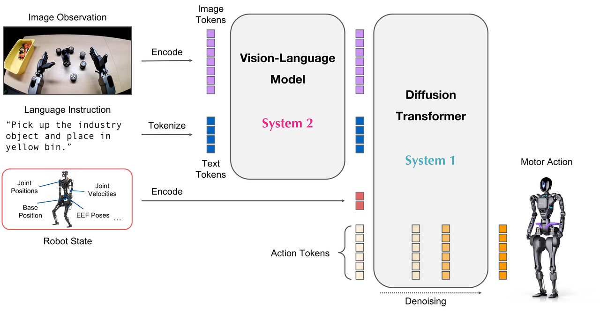
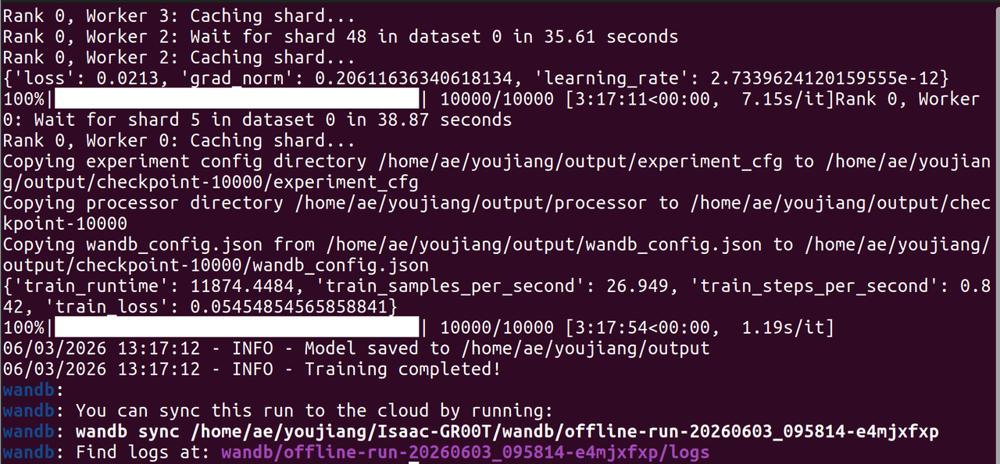
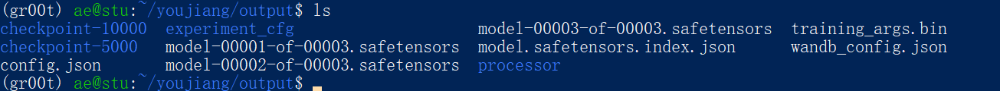

# Train the GR00T 1.7 Policy

This article introduces Nvidia's latest VLA model, Isaac GR00T 1.7, and fine-tunes a task-specific VLA model using the training data prepared in previous sections.

## Learning Objectives

- Understand the Nvidia Isaac GR00T 1.7 VLA model
- Fine-tune a GR00T 1.7 model using previously collected data

## Nvidia Isaac GR00T 1.7

NVIDIA Isaac GR00T 1.7 is an open vision-language-action (VLA) model for generalized humanoid robot skills. This cross-embodiment model takes multimodal input, including language and images, to perform manipulation tasks in diverse environments.



## Prepare Python Env

```bash
sudo apt install git-lfs && git lfs install
cd ~
git clone --recurse-submodules https://github.com/NVIDIA/Isaac-GR00T
cd Isaac-GR00T
sudo apt-get update && sudo apt-get install -y ffmpeg
uv sync --python 3.12
```

## Handling the Dataset

```bash
cd ~/Isaac-GR00T
uv run --project scripts/lerobot_conversion \
  python scripts/lerobot_conversion/convert_v3_to_v2.py \
  --repo-id /home/seeed/.cache/huggingface/lerobot/seeed_rebot_b601_rs/organize_stationery
```

> [!WARNING]
> Note: Please replace the file paths.

After execution, the program will downgrade the previously collected LeRobot dataset from version V3 to V2. Then, copy the following files into the `meta` folder of the converted dataset.

`modality.json`:

```json
{
    "state": {
        "single_arm": {
            "start": 0,
            "end": 6
        },
        "gripper": {
            "start": 6,
            "end": 7
        }
    },
    "action": {
        "single_arm": {
            "start": 0,
            "end": 6
        },
        "gripper": {
            "start": 6,
            "end": 7
        }
    },
    "video": {
        "front": {
            "original_key": "observation.images.front"
        },
        "side": {
            "original_key": "observation.images.side"
        }
    },
    "annotation": {
        "human.task_description": {
            "original_key": "task_index"
        }
    }
}
```

## Finetune the GR00T 1.7

Prepare the training configuration file:

```bash
cd ~/Isaac-GR00T
mkdir -p examples/rebot_arm
```

Then, copy the following files into `examples/rebot_arm`.

`rebot_config.py`:

```python
# SPDX-FileCopyrightText: Copyright (c) 2026 NVIDIA CORPORATION & AFFILIATES. All rights reserved.
# SPDX-License-Identifier: Apache-2.0
#
# Licensed under the Apache License, Version 2.0 (the "License");
# you may not use this file except in compliance with the License.
# You may obtain a copy of the License at
#
# http://www.apache.org/licenses/LICENSE-2.0
#
# Unless required by applicable law or agreed to in writing, software
# distributed under the License is distributed on an "AS IS" BASIS,
# WITHOUT WARRANTIES OR CONDITIONS OF ANY KIND, either express or implied.
# See the License for the specific language governing permissions and
# limitations under the License.

from gr00t.configs.data.embodiment_configs import register_modality_config
from gr00t.data.embodiment_tags import EmbodimentTag
from gr00t.data.types import (
    ActionConfig,
    ActionFormat,
    ActionRepresentation,
    ActionType,
    ModalityConfig,
)


rebot_config = {
    # Video: current frame only; keys must match "video" entries in meta/modality.json
    "video": ModalityConfig(
        delta_indices=[0],
        modality_keys=["front", "side"],  # front third-person view + side egocentric
    ),
    # State: current proprioceptive reading; keys must match "state" entries in meta/modality.json
    "state": ModalityConfig(
        delta_indices=[0],
        modality_keys=[
            "single_arm",  # joint positions
            "gripper",  # gripper state
        ],
    ),
    # Action: 16-step prediction horizon; one ActionConfig per modality key
    "action": ModalityConfig(
        delta_indices=list(range(0, 16)),  # predict 16 future steps
        modality_keys=[
            "single_arm",
            "gripper",
        ],
        action_configs=[
            # single_arm: RELATIVE - delta from current state (better generalization)
            ActionConfig(
                rep=ActionRepresentation.RELATIVE,
                type=ActionType.NON_EEF,  # joint-space, not end-effector
                format=ActionFormat.DEFAULT,
            ),
            # gripper: ABSOLUTE - target position (binary open/close works better absolute)
            ActionConfig(
                rep=ActionRepresentation.ABSOLUTE,
                type=ActionType.NON_EEF,
                format=ActionFormat.DEFAULT,
            ),
        ],
    ),
    # Language: task instruction from annotation field in the dataset
    "language": ModalityConfig(
        delta_indices=[0],
        modality_keys=["annotation.human.task_description"],
    ),
}

register_modality_config(rebot_config, embodiment_tag=EmbodimentTag.NEW_EMBODIMENT)
```

Once everything is ready, please start the fine-tuning script using the following command.

```bash
cd ~/Isaac-GR00T

export SAVE_STEPS=5000
bash examples/finetune.sh \
  --base-model-path nvidia/GR00T-1.7-3B \
  --dataset-path /home/ae/youjiang/grab_jetson \
  --modality-config-path examples/rebot_arm/rebot_config.py \
  --embodiment-tag NEW_EMBODIMENT \
  --output-dir ~/youjiang/output
```

> [!WARNING]
> Note: Please replace the paths for the dataset and output folder.

> [!WARNING]
> Note: Given the relatively small size of our training dataset, consider reducing the number of training epochs to conserve computational resources.

*Training Execution Output Log:*



After training is complete, you can find the fine-tuned GR00T 1.7 model files in the `--output-dir` directory.



## References

- [Hugging Face GR00T-1.7-3B Model Repository](https://huggingface.co/nvidia/GR00T-1.7-3B/tree/main)
- [NVIDIA Isaac-GR00T GitHub Repository](https://github.com/NVIDIA/Isaac-GR00T/tree/main)
