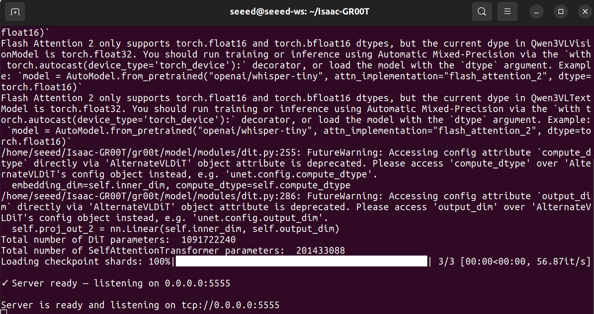

# Evaluate in Real Env

In this article, we will demonstrate how to deploy the trained GR00T 1.7 model in a real-world environment to validate the practical performance of the model obtained from the training process described in previous sections.

## Learning Objectives

- Load the fine-tuned GR00T model and perform inference validation.
- Use the VLA model to control the reBot Arm for autonomous manipulation.

## Getting Started

The Isaac GR00T deployment architecture adopts a decoupled design that separates the inference side from the control side:

- **Inference Side (Server)**: Dedicated exclusively to executing model inference tasks.
- **Control Side (Client)**: Responsible for acquiring the robotic arm's state and coordinating its motion control.

Users can choose to run the server and client on two separate devices, or, as demonstrated in this article, run both the server and client simultaneously on a single computer.

> [!WARNING]
> Note: Please ensure your computer is equipped with an NVIDIA GPU with at least 8 GB of VRAM.

## 🖥️ Terminal 1: Start Local Inference Server

Open the first terminal on your PC, start the local inference server with the following command:

```bash
cd <path-to-isaac-gr00t>
uv run python gr00t/eval/run_gr00t_server.py \
  --model-path ~/youjiang/output/checkpoint-10000 \
  --embodiment-tag NEW_EMBODIMENT
```

Where `--model-path` is the path to the fine-tuned model weights.

*Server Execution Log:*



## 🤖 Terminal 2: Start Local Inference Client

Open the second terminal on your PC, start the local inference client with the following command:

```bash
# follower
sudo ip link set can0 down 2>/dev/null
sudo ip link set can0 type can bitrate 1000000 restart-ms 100
sudo ip link set can0 up

python eval_rebot_arm_rs.py \
  --robot-port can0 \
  --robot-id follower1 \
  --front-camera /dev/video0 \
  --side-camera /dev/video6 \
  --policy-host 127.0.0.1 \
  --policy-port 5555 \
  --instruction "Organize stationery" \
  --duration-s 25 \
  --execute
```

> [!WARNING]
> The Python environment needs to include both the LeRobot environment and the Isaac GR00T environment.

## Demo

In our demonstration, GR00T has successfully controlled the robotic arm to perform autonomous manipulation.


