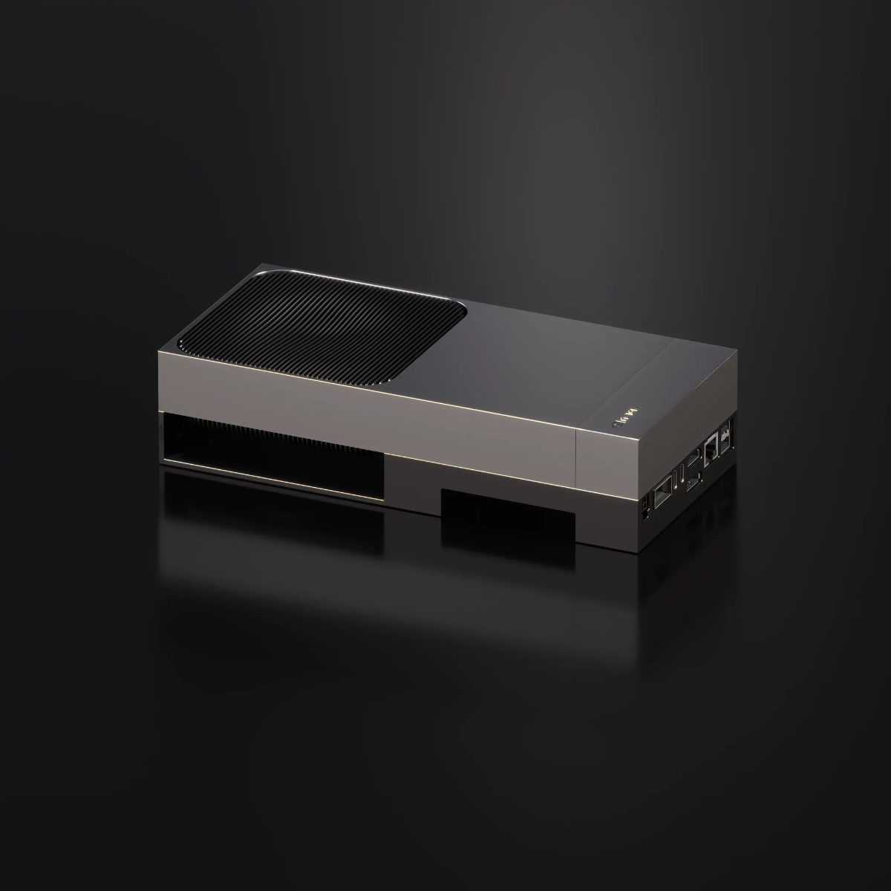
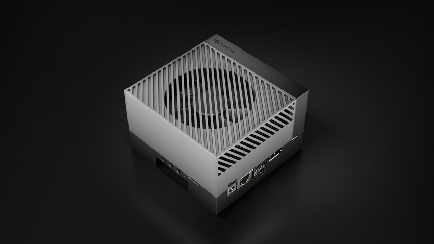
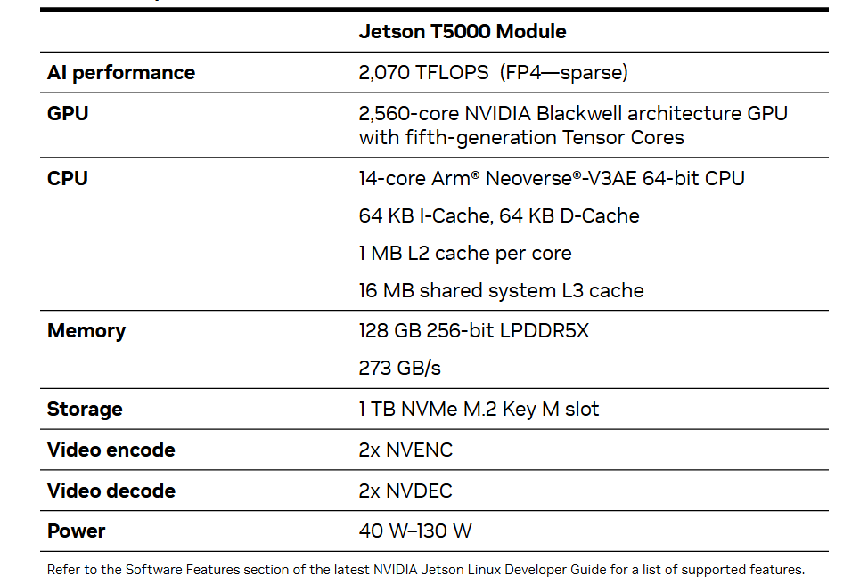
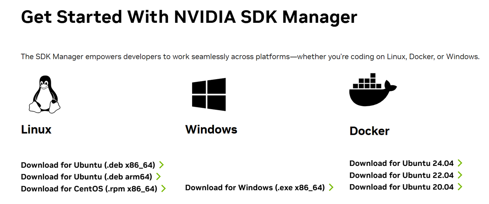
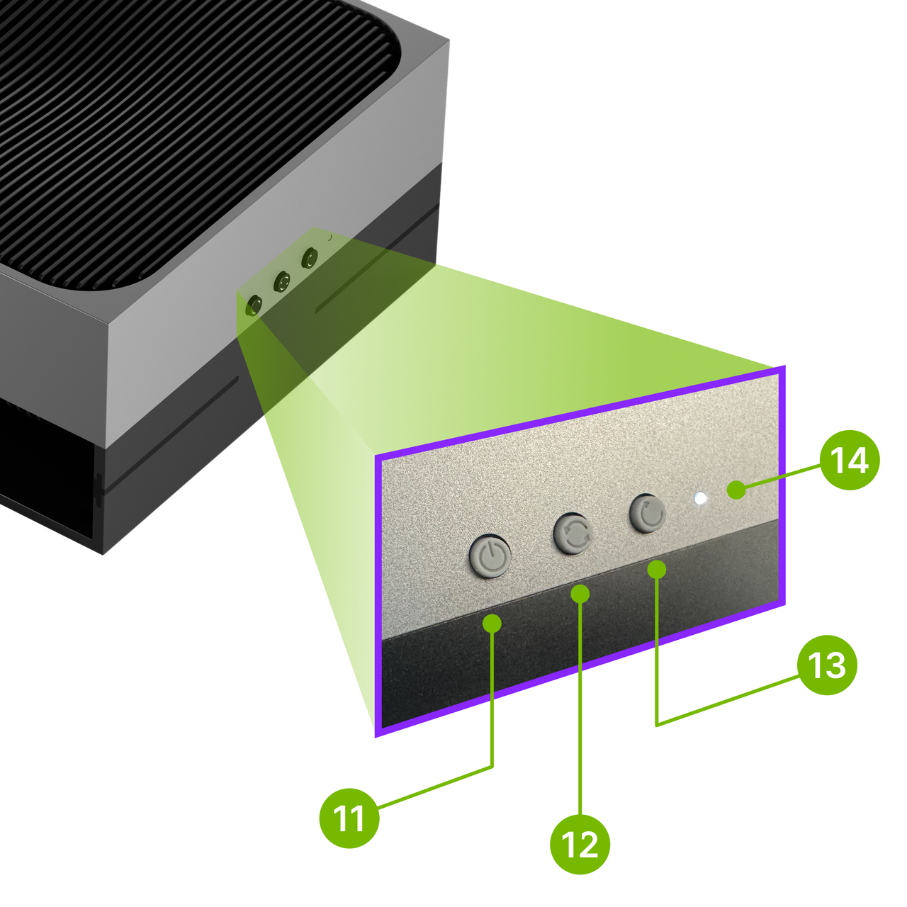
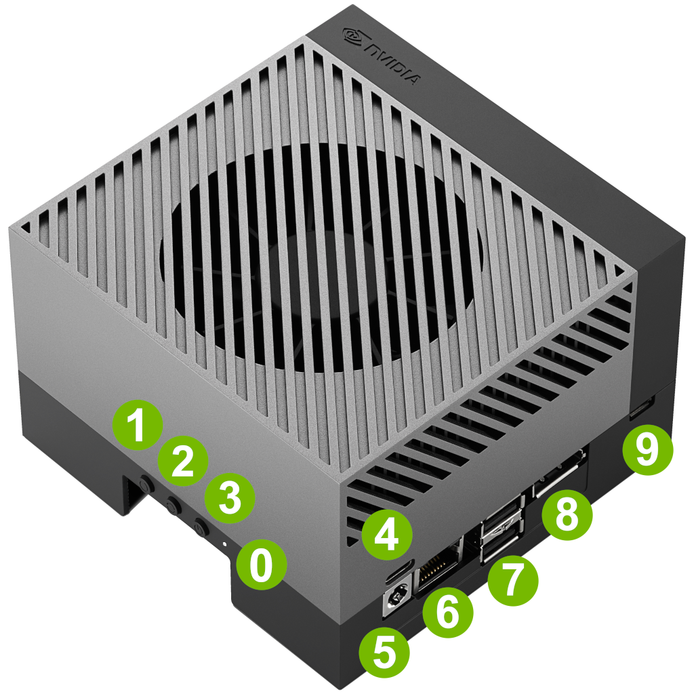
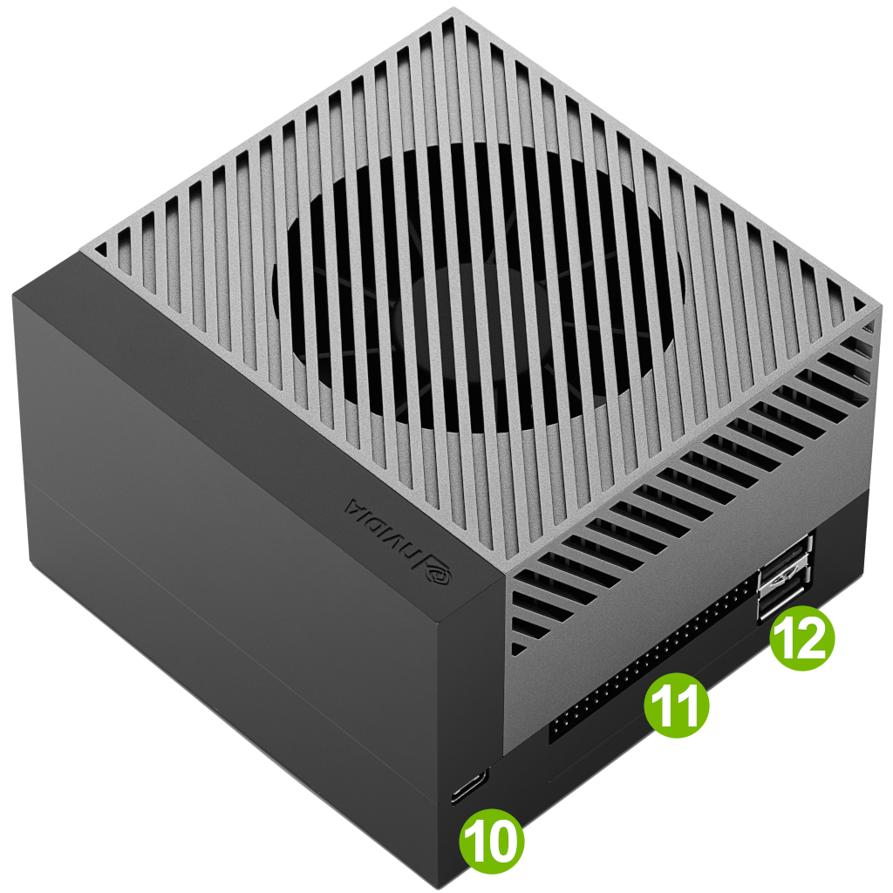
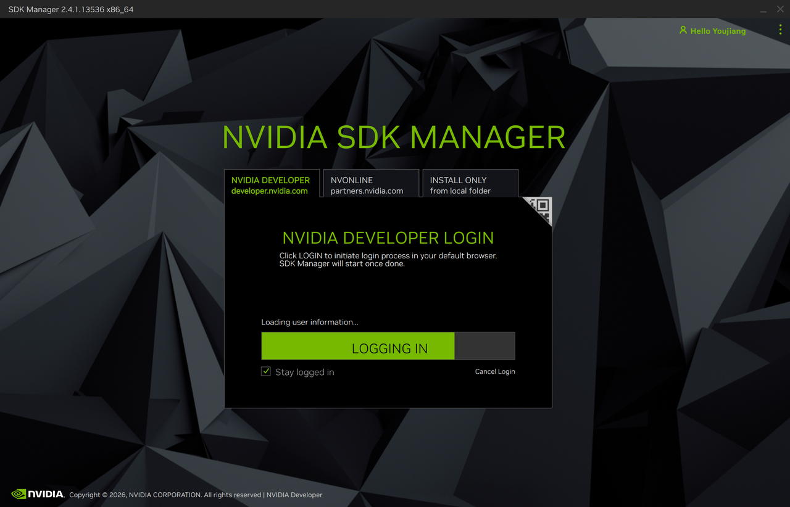
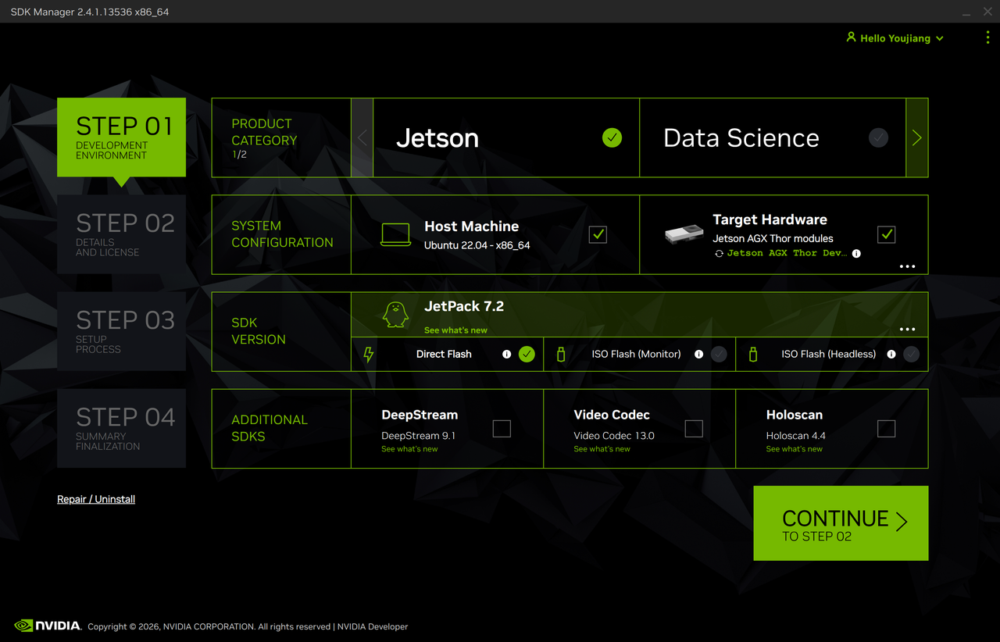
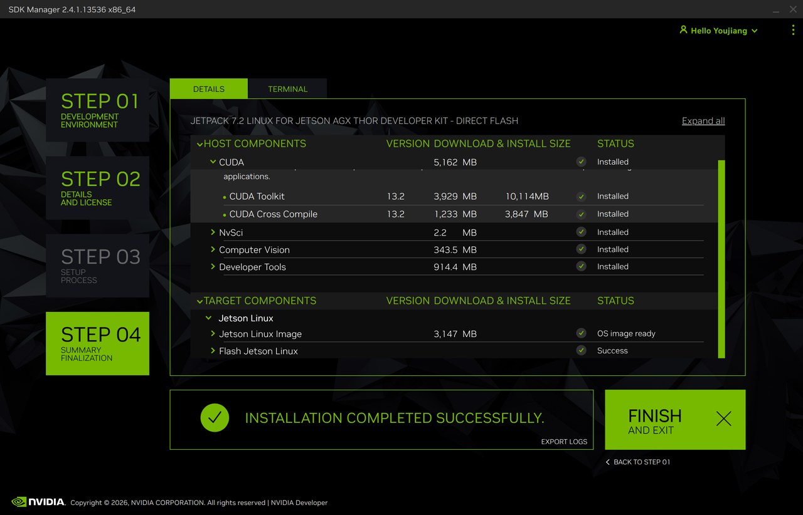

# Setup Your Jetson Edge Device

## Introduction

This chapter prepares the Jetson platform used throughout the GR00T 1.7 deployment series. The validated targets are Jetson AGX Orin and Jetson AGX Thor. Complete the operating-system installation and basic platform checks here before connecting the robot or installing the inference software.

<div style="display: flex; gap: 1rem; margin: 1.5rem 0;">
  
  
</div>

## Learning Objectives

- Select the correct Jetson target for the deployment.
- Install the required JetPack release.
- Verify the board model, L4T release, CUDA runtime, storage, and system readiness.

## Supported Targets

| Target | Validated software path | Runtime environment used later |
|---|---|---|
| Jetson AGX Orin | JetPack 7.2 / L4T R39.2 | `.venv-jp72` with `scripts/activate_orin_jp72.sh` |
| Jetson AGX Thor | JetPack 7.2 / L4T R39.2 | `.venv` with `scripts/activate_thor.sh` |



> [!NOTE]
> TensorRT engines are target-specific. Orin and Thor may share the same compatible checkpoint and dataset, but each target must build its own engine bundle.

## Prepare the Host Computer

Prepare an Ubuntu host with:

- at least 25 GB of free space for SDK Manager and JetPack packages;
- a reliable USB Type-C data cable;
- a stable network connection;
- administrator access.

Install NVIDIA SDK Manager from the official download page:

- [NVIDIA SDK Manager](https://developer.nvidia.com/sdk-manager)



## Enter Force Recovery Mode

### Jetson AGX Thor Developer Kit

1. Power off the Jetson.
2. Connect its recovery USB Type-C port to the host computer.
3. Hold the Force Recovery button.
4. Press and release Reset while continuing to hold Force Recovery.
5. Release Force Recovery.
6. Confirm that SDK Manager detects the target.

| Mark | Button |
|---|---|
| 11 | Power |
| 12 | Force Recovery |
| 13 | Reset |



### Jetson AGX Orin Developer Kit

The Jetson AGX Orin Developer Kit uses different button and connector numbers from the Jetson AGX Thor Developer Kit. Follow the labels in the official NVIDIA diagrams below.

> [!NOTE]
> **Button method:** The developer kit must be powered on before you begin. Use button **2** (Force Recovery) and button **3** (Reset).

1. Connect USB Type-C port **10**, located next to the 40-pin header, to the Ubuntu host computer.
2. Connect the power supply and make sure the developer kit is powered on.
3. Press and hold button **2** (Force Recovery).
4. While holding Force Recovery, press and hold button **3** (Reset).
5. Release both buttons.
6. Confirm that NVIDIA SDK Manager detects the Jetson AGX Orin target.

| Mark | Button or port |
|---|---|
| 1 | Power button |
| 2 | Force Recovery button |
| 3 | Reset button |
| 10 | USB Type-C port used for flashing |

<div style="display: flex; gap: 1.5rem; margin: 1.5rem 0;">
  <div style="flex: 1; text-align: center;">
    
    <p style="font-size: 0.825rem; color: var(--nv-text-muted); margin-top: 0.5rem; text-align: center;">Jetson AGX Orin Developer Kit buttons: 1 Power, 2 Force Recovery, 3 Reset. Source: NVIDIA.</p>
  </div>
  <div style="flex: 1; text-align: center;">
    
    <p style="font-size: 0.825rem; color: var(--nv-text-muted); margin-top: 0.5rem; text-align: center;">Jetson AGX Orin Developer Kit flashing port: 10 USB Type-C next to the 40-pin header. Source: NVIDIA.</p>
  </div>
</div>

### Alternative: Enter Recovery Mode While Powered Off

1. Make sure the developer kit is powered off.
2. Press and hold button **2** (Force Recovery).
3. Connect the power supply. If the power LED does not turn on, press and release button **1** (Power).
4. Release Force Recovery.
5. Confirm that NVIDIA SDK Manager detects the target.

Reference: [NVIDIA Jetson AGX Orin Developer Kit User Guide: Force Recovery Mode](https://docs.nvidia.com/jetson/user-guides/my-jetson/site/orin/agx-orin/force_recovery.html)

## Install JetPack

In SDK Manager:

1. Select **Jetson AGX Thor / Jetson AGX Orin** as the target hardware.
2. Select **JetPack 7.2**.
3. Use **Direct Flash** unless the deployment requires an ISO workflow.
4. Complete the target installation and initial Ubuntu setup.







> [!NOTE]
> Follow the SDK Manager wizard through **Installation completed successfully** before disconnecting the recovery cable.

## Verify the Jetson

Run these commands on the target:

```bash
tr -d '\0' < /proc/device-tree/model
cat /etc/nv_tegra_release
df -h /
free -h
```

Confirm that:

- the detected model matches the intended Orin or Thor target;
- the system reports the expected JetPack/L4T release;
- the NVMe or root filesystem has enough space for the checkpoint, backbone, ONNX files, and TensorRT engines;
- the system boots normally after a restart.

Reserve approximately 45–50 GB for a complete local TensorRT workflow.

## Next Step

Continue with [Connect the Robot Hardware](https://seeedstudio.feishu.cn/wiki/VCR2w8XxRiqMVfkr1qQc8BClnXf) to connect the reBot arm, cameras, and USB-CAN adapter and to verify their Linux device nodes.


