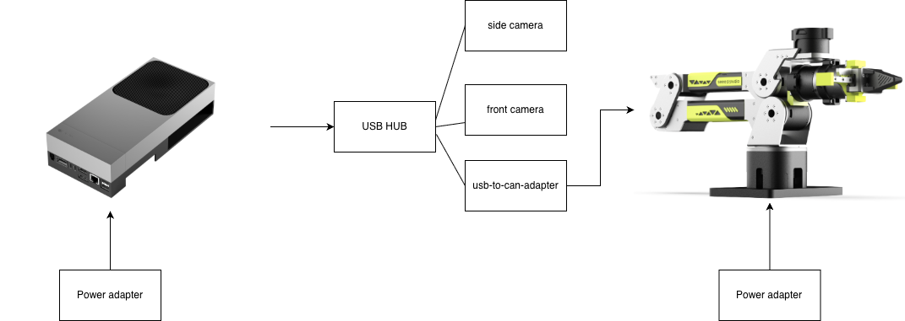

# Connect the Robot Hardware

## Introduction

This chapter connects the Jetson edge device to the reBot B601-RS control hardware. The same physical topology applies to Orin and Thor; only the available USB ports and the required JetPack 7.2 kernel modules may differ.

Keep the camera placement, robot geometry, and CAN configuration consistent with the setup used to collect the dataset.

## Learning Objectives

- Connect the reBot arm, two USB cameras, and USB-CAN adapter to Orin or Thor.
- Install and verify the JetPack 7.2 USB-CAN kernel modules.
- Identify the correct CAN interface and camera device nodes before inference.

## Hardware Requirements

- Jetson AGX Orin or Jetson AGX Thor with JetPack 7.2
- [reBot Arm B601 RS](https://www.seeedstudio.com/reBot-Arm-B601-RS-Bundle-p-6898.html)
- [USB-to-CAN adapter](https://www.seeedstudio.com/CANABLE-p-6709.html)
- two USB cameras
- powered USB 3.0 hub when the Jetson does not provide enough ports
- robot power supply and USB data cables

## Connect the Devices

Connect the devices in this order:

1. Keep the robot power disabled.
2. Connect the USB-CAN adapter to the Jetson.
3. Connect the front and side cameras, using a powered USB hub if required.
4. Connect CAN-H, CAN-L, and ground according to the robot wiring specification.
5. Check CAN termination before applying robot power.




> [!CAUTION]
> Jetson AGX Thor provides only two USB Type-A ports. Use a powered USB hub when connecting two cameras and a USB-CAN adapter simultaneously.

## Install the JetPack 7.2 USB-CAN Drivers

Download both `gs_usb.ko` and `peak_usb.ko` from:

- [JetPack 7.2 USB-CAN kernel modules](https://seeedstudio88-my.sharepoint.com/:f:/g/personal/youjiang_yu_seeedstudio88_onmicrosoft_com/IgBFxTfVKBVUTaGrYiUKryiHAZ6jMLUqcRFoE2DeAod7gRs?e=P932nb)

Verify that both modules match the running kernel:

```bash
cd "${HOME}/Downloads/jp7.2-ko"
uname -r
modinfo ./gs_usb.ko | grep -E '^(name|vermagic|depends):'
modinfo ./peak_usb.ko | grep -E '^(name|vermagic|depends):'
```

Install and load them:

```bash
KERNEL_RELEASE="$(uname -r)"

sudo install -D -m 0644 gs_usb.ko \
  "/lib/modules/${KERNEL_RELEASE}/extra/gs_usb.ko"
sudo install -D -m 0644 peak_usb.ko \
  "/lib/modules/${KERNEL_RELEASE}/extra/peak_usb.ko"

sudo depmod -a
sudo modprobe gs_usb
sudo modprobe peak_usb
```

Do not force-load a module whose `vermagic` does not match `uname -r`.

## Identify the CAN Interface

```bash
lsusb
ip -brief link | grep -E 'can[0-9]+'
```

Set the interface after identifying it:

```bash
export GR00T_CAN_IFACE=canN

sudo ip link set "${GR00T_CAN_IFACE}" down 2>/dev/null || true
sudo ip link set "${GR00T_CAN_IFACE}" type can bitrate 1000000 restart-ms 100
sudo ip link set "${GR00T_CAN_IFACE}" up
ip -details -statistics link show "${GR00T_CAN_IFACE}"
```

Replace `canN` with the interface shown on your Jetson. Resolve `ERROR-PASSIVE` or `BUS-OFF` before continuing.

## Identify the Cameras

```bash
sudo apt update
sudo apt install -y v4l-utils

v4l2-ctl --list-devices
ls -l /dev/video*
```

Preview every candidate device and assign the verified nodes:

```bash
export GR00T_FRONT_CAMERA=/dev/videoX
export GR00T_SIDE_CAMERA=/dev/videoY

test -e "${GR00T_FRONT_CAMERA}"
test -e "${GR00T_SIDE_CAMERA}"
```

Do not assume that `/dev/video0` and `/dev/video1` remain stable after reconnecting USB devices.

## Hardware Readiness Checklist

- [ ] Robot power remains disabled during software setup.
- [ ] Both CAN kernel modules match the running kernel and load successfully.
- [ ] The selected CAN interface is `UP` and does not report bus errors.
- [ ] Front and side camera nodes have been visually identified.
- [ ] Camera placement matches the dataset collection setup.

## Next Step

Continue with [Configure the GR00T Software Environment](#lesson-4.3) to install the target-specific Python, CUDA, and TensorRT runtime.


