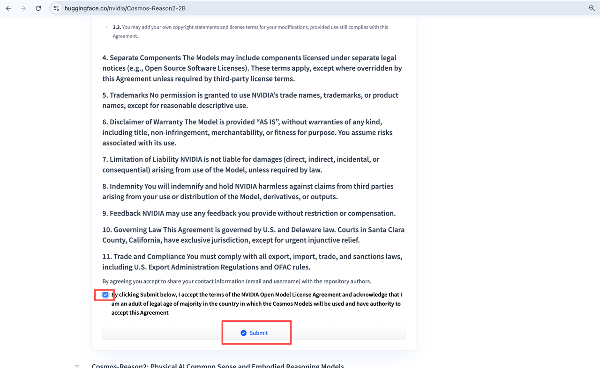
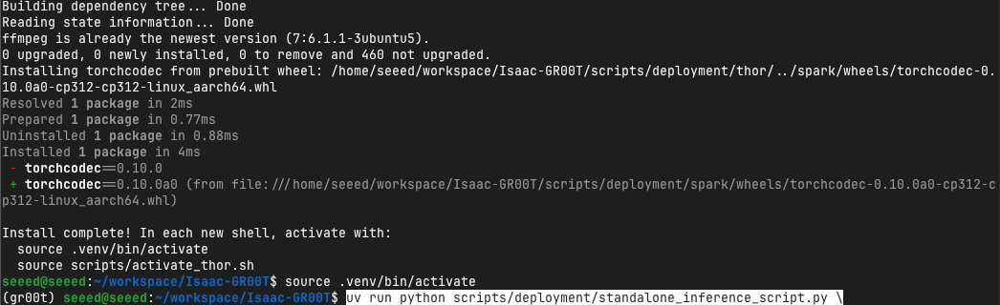

# Configure the GR00T Software Environment

## Introduction

This chapter installs the validated GR00T N1.7 deployment repository and prepares the target-specific runtime. Complete it after JetPack and the hardware interfaces are working. Model assets and dataset conversion are handled in the next chapter.

## Learning Objectives

- Configure reusable paths for the repository and deployment assets.
- Install the validated Orin or Thor runtime.
- Authenticate with Hugging Face and verify the software environment.

## Select the Target

```bash
# Jetson AGX Orin
export GR00T_TARGET=orin

# Jetson AGX Thor
export GR00T_TARGET=thor

tr -d '\0' < /proc/device-tree/model
```

Confirm that `GR00T_TARGET` matches the detected board.

## Define the Workspace

```bash
mkdir -p "${HOME}/.config/gr00t-inference"

cat > "${HOME}/.config/gr00t-inference/paths.sh" <<'EOF_PATHS'
: "${GR00T_TARGET:=orin}"

export GR00T_WORKSPACE="${GR00T_WORKSPACE:-${HOME}/gr00t-inference}"
export GR00T_REPO="${GR00T_REPO:-${GR00T_WORKSPACE}/Isaac-GR00T-Orin-JP72}"
export GR00T_MODEL_PATH="${GR00T_MODEL_PATH:-${GR00T_WORKSPACE}/checkpoints/checkpoint-10000}"
export GR00T_DATASET_PATH="${GR00T_DATASET_PATH:-${GR00T_WORKSPACE}/datasets/rebot_eval_v2}"
export GR00T_BACKBONE_PATH="${GR00T_BACKBONE_PATH:-${GR00T_WORKSPACE}/models/nvidia/Cosmos-Reason2-2B}"
export GR00T_TRT_OUTPUT="${GR00T_TRT_OUTPUT:-${GR00T_WORKSPACE}/artifacts/${GR00T_TARGET}/rebot_trt}"
export GR00T_RESULT_PATH="${GR00T_RESULT_PATH:-${GR00T_WORKSPACE}/results/${GR00T_TARGET}/rebot_trt_result.jpeg}"
EOF_PATHS

source "${HOME}/.config/gr00t-inference/paths.sh"
mkdir -p "$(dirname "${GR00T_REPO}")" "${GR00T_MODEL_PATH}" \
  "${GR00T_DATASET_PATH}" "${GR00T_BACKBONE_PATH}" \
  "${GR00T_TRT_OUTPUT}" "$(dirname "${GR00T_RESULT_PATH}")"
```

## Clone the Validated Repository

```bash
source "${HOME}/.config/gr00t-inference/paths.sh"

git clone https://github.com/jjjadand/Isaac-GR00T-Orin-JP72.git "${GR00T_REPO}"
cd "${GR00T_REPO}"
git checkout dcf5f6b759fd17cab3644a97fc4429bca7451e38
git submodule update --init --recursive
```

Keep the repository at the validated revision while reproducing this workflow.

## Install the Platform Runtime

### Jetson AGX Orin with JetPack 7.2

```bash
cd "${GR00T_REPO}"
bash scripts/deployment/orin_jp72/install_deps.sh
source .venv-jp72/bin/activate
source scripts/activate_orin_jp72.sh
```

The installer validates the JetPack 7.2 stack and creates `.venv-jp72`.

### Jetson AGX Thor

Bare-metal installation:

```bash
cd "${GR00T_REPO}"
bash scripts/deployment/thor/install_deps.sh
source .venv/bin/activate
source scripts/activate_thor.sh
```

Thor may also use the repository's Thor Docker profile when an isolated environment is preferred.

## Obtain Hugging Face Access

The official GR00T N1.7 backbone is `nvidia/Cosmos-Reason2-2B` and requires acceptance of the NVIDIA model license.

1. Open [NVIDIA Cosmos-Reason2-2B](https://huggingface.co/nvidia/Cosmos-Reason2-2B).
2. Accept the license agreement.
3. Authenticate on the Jetson:

```bash
uv tool install -U "huggingface_hub[cli]"
hf auth login
```



Do not store Hugging Face tokens in the repository or shell scripts.

## Verify the Environment

```bash
cd "${GR00T_REPO}"

python - <<'PY'
import os
import platform
import torch

print("machine:", platform.machine())
print("python:", platform.python_version())
print("torch:", torch.__version__)
print("cuda available:", torch.cuda.is_available())
print("target:", os.environ.get("GR00T_TARGET"))
PY
```

The command must report `aarch64`, a CUDA-enabled PyTorch build, and the expected target environment.

*Verification Terminal Log Output:*



## Next Step

Continue with [Prepare the Dataset and Model Assets](https://seeedstudio.feishu.cn/wiki/LAKxw9izKivJFEkOrEYchZPfnNf). That chapter validates the fine-tuned checkpoint, VLM backbone, and LeRobot dataset consumed by the TensorRT exporter.
