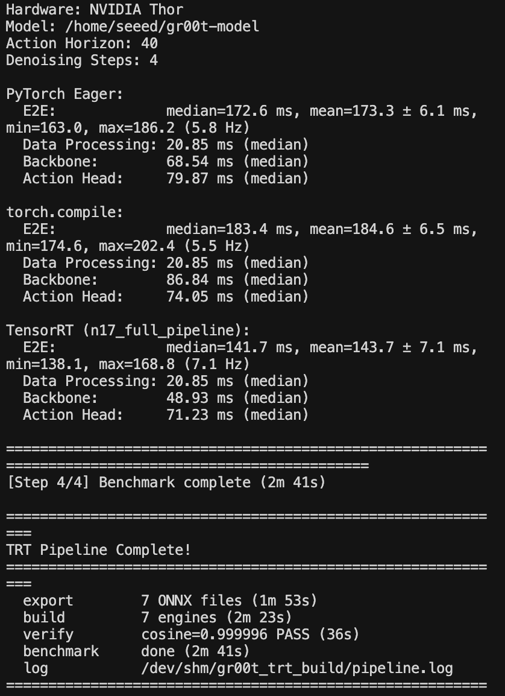

# Prepare the Dataset and Model Assets

## Introduction

GR00T TensorRT export requires the same dataset schema, embodiment configuration, checkpoint metadata, and VLM backbone used during training. This chapter converts a LeRobot v3.0 recording into the per-episode layout consumed by the validated GR00T 1.7 workflow and verifies all model assets before export.

## Learning Objectives

- Convert a LeRobot v3.0 dataset to the GR00T-compatible v2.1 layout.
- Verify camera modalities, robot state, actions, tasks, and episode metadata.
- Validate the fine-tuned checkpoint and VLM backbone required by TensorRT export.

## Dataset Compatibility

The converted dataset must preserve the camera keys, state/action dimensions, task labels, and episode boundaries used during fine-tuning. The following converter is configured for the Seeed reBot B601 dataset and must be adapted if your modality names differ.

## Convert LeRobot v3.0 to v2.1

```python
#!/usr/bin/env python3
"""
LeRobot v3.0 to v2.1 Format Converter for Seeed REBOT-B601-DM Dataset

Converts a LeRobot v3.0 dataset to v2.1 format compatible with GR00T's
LeRobotEpisodeLoader.

Usage:
    python convert_v3_to_v2.py \
        --input /home/seeed/.cache/huggingface/lerobot/seeed_rebot_b601_dm/test \
        --output /home/seeed/.cache/huggingface/lerobot/seeed_rebot_b601_dm/test_v2

The converter:
  1. Reads episodes from meta/episodes/chunk-*/file-*.parquet
  2. Splits data parquet into per-episode parquet files (v2.1 naming)
  3. Symlinks video MP4 files into v2.1 directory structure
  4. Generates meta/modality.json, meta/tasks.jsonl, meta/episodes.jsonl
"""

import argparse
import json
import os
import shutil
from pathlib import Path

import pandas as pd

def _val(x):
    """Convert pyarrow/pandas scalar to native Python value."""
    if hasattr(x, "item"):
        return x.item()
    elif hasattr(x, "tolist"):
        return x.tolist()
    return x

# ============================================================================
# 1. meta/modality.json
# ============================================================================

MODALITY_JSON = {
    "video": {
        "down_size": {
            "type": "video",
            "original_key": "observation.images.down_size"
        },
        "up_side": {
            "type": "video",
            "original_key": "observation.images.up_side"
        }
    },
    "state": {
        "single_arm": {
            "start": 0,
            "end": 6,
            "original_key": "observation.state"
        },
        "gripper": {
            "start": 6,
            "end": 7,
            "original_key": "observation.state"
        }
    },
    "action": {
        "single_arm": {
            "start": 0,
            "end": 6,
            "original_key": "action"
        },
        "gripper": {
            "start": 6,
            "end": 7,
            "original_key": "action"
        }
    },
    "annotation": {
        "language.language_instruction": {
            "original_key": "task_index"
        }
    }
}

# ============================================================================
# 2. Convert tasks.parquet -> tasks.jsonl
# ============================================================================

def convert_tasks(input_dir: Path, output_dir: Path):
    """Convert tasks.parquet to tasks.jsonl.

    tasks.parquet only contains task_index values (no text).
    Task text is extracted from episodes metadata 'tasks' column.
    """
    # Extract task text from first episode's metadata
    eps_dir = input_dir / "meta" / "episodes"
    task_text = "unknown"
    for chunk_dir in sorted(eps_dir.iterdir()):
        if chunk_dir.is_dir():
            for pf in sorted(chunk_dir.glob("*.parquet")):
                df_eps = pd.read_parquet(pf, engine="pyarrow")
                for _, row in df_eps.iterrows():
                    tasks_val = row.get("tasks", None)
                    if tasks_val is not None:
                        if hasattr(tasks_val, "tolist"):
                            tasks_val = tasks_val.tolist()
                        if isinstance(tasks_val, (list, tuple)) and len(tasks_val) > 0:
                            task_text = str(tasks_val[0])
                            break
                if task_text != "unknown":
                    break
            if task_text != "unknown":
                break

    # Load tasks.parquet to get task indices
    tasks_path = input_dir / "meta" / "tasks.parquet"
    df_tasks = pd.read_parquet(tasks_path, engine="pyarrow")

    tasks = []
    for _, row in df_tasks.iterrows():
        ti_val = row["task_index"]
        ti = int(ti_val.item()) if hasattr(ti_val, "item") else int(ti_val)
        tasks.append({"task_index": ti, "task": task_text})

    tasks_path_out = output_dir / "meta" / "tasks.jsonl"
    with open(tasks_path_out, "w") as f:
        for t in tasks:
            f.write(json.dumps(t) + "\n")
    print(f"  Created tasks.jsonl ({len(tasks)} tasks)")

# ============================================================================
# 3. Convert episodes -> episodes.jsonl
# ============================================================================

def convert_episodes(input_dir: Path, output_dir: Path):
    """Convert episodes parquet files to episodes.jsonl."""
    eps_dir = input_dir / "meta" / "episodes"

    all_eps = []
    for chunk_dir in sorted(eps_dir.iterdir()):
        if chunk_dir.is_dir():
            for pf in sorted(chunk_dir.glob("*.parquet")):
                df = pd.read_parquet(pf, engine="pyarrow")
                for _, row in df.iterrows():
                    def get(v):
                        val = row[v]
                        if hasattr(val, "tolist"):
                            val = val.tolist()
                        return val

                    tasks_val = get("tasks")
                    if isinstance(tasks_val, (list, tuple)) and len(tasks_val) > 0:
                        tasks_str = [str(tasks_val[0])]
                    else:
                        tasks_str = ["unknown"]

                    ep = {
                        "episode_index": int(get("episode_index")),
                        "length": int(get("length")),
                        "tasks": tasks_str,
                    }
                    all_eps.append(ep)

    all_eps.sort(key=lambda x: x["episode_index"])
    eps_path_out = output_dir / "meta" / "episodes.jsonl"
    with open(eps_path_out, "w") as f:
        for ep in all_eps:
            f.write(json.dumps(ep) + "\n")
    print(f"  Created episodes.jsonl ({len(all_eps)} episodes)")

# ============================================================================
# 4. Split data parquet -> per-episode parquet files (v2.1 naming)
# ============================================================================

def get_episode_data_indices(ep_df: pd.DataFrame, episode_index: int) -> tuple:
    """
    Get the start and end data row indices for a specific episode.
    The data parquet contains rows ordered by global index.
    episode_index tells us which episode each row belongs to.
    """
    mask = ep_df["episode_index"] == episode_index
    indices = ep_df[mask].index.tolist()
    if not indices:
        return None, None
    return indices[0], indices[-1]

def convert_data_parquet(input_dir: Path, output_dir: Path):
    """
    Split combined data parquet files into per-episode parquet files.

    v3.0: data/chunk-000/file-000.parquet contains ALL episodes' data
    v2.1: data/chunk-000/episode_000000.parquet  (one per episode)
    """
    data_dir = input_dir / "data"
    output_data = output_dir / "data"

    # Build episode -> data_file mapping from episodes metadata
    eps_dir = input_dir / "meta" / "episodes"
    ep_data_map = {}  # ep_idx -> (chunk_idx, file_idx)
    for chunk_dir in sorted(eps_dir.iterdir()):
        if chunk_dir.is_dir():
            for pf in sorted(chunk_dir.glob("*.parquet")):
                df_eps = pd.read_parquet(pf, engine="pyarrow")
                for _, erow in df_eps.iterrows():
                    ei = int(_val(erow["episode_index"]))
                    dci = int(_val(erow["data/chunk_index"]))
                    dfi = int(_val(erow["data/file_index"]))
                    ep_data_map[ei] = (dci, dfi)

    # Group data files by chunk for processing
    chunk_files = {}
    for chunk_dir in sorted(data_dir.iterdir()):
        if not chunk_dir.is_dir():
            continue
        chunk_idx = int(chunk_dir.name.split("-")[1])
        files = {}
        for pf in sorted(chunk_dir.glob("*.parquet")):
            file_idx = int(pf.stem.split("-")[1])
            files[file_idx] = pf
        chunk_files[chunk_idx] = files

    # Process each chunk
    for chunk_idx, files in sorted(chunk_files.items()):
        output_chunk = output_data / f"chunk-{chunk_idx:03d}"
        output_chunk.mkdir(parents=True, exist_ok=True)

        # Collect all episode parquet assignments for this chunk
        ep_chunks = {}  # ep_idx -> parquet_path
        for ep_idx, (dci, dfi) in sorted(ep_data_map.items()):
            if dci == chunk_idx:
                ep_chunks[ep_idx] = files[dfi]

        # Read each data file and split by episode
        for ep_idx, parquet_path in sorted(ep_chunks.items()):
            df = pd.read_parquet(parquet_path, engine="pyarrow")
            # Extract rows for this episode
            ep_rows = df[df["episode_index"] == ep_idx]
            # Drop per-frame metadata columns (keep only action & state)
            cols_to_keep = [c for c in ep_rows.columns if c in ("action", "observation.state", "task_index")]
            ep_rows = ep_rows[cols_to_keep].reset_index(drop=True)
            out_name = f"episode_{ep_idx:06d}.parquet"
            out_path = output_chunk / out_name
            ep_rows.to_parquet(out_path, engine="pyarrow", index=False)

    # Verify
    total_eps = sum(len(list(output_data.glob("chunk-*/episode_*.parquet"))) for _ in [1])
    print(f"  Converted data: {total_eps} episode parquet files")

# ============================================================================
# 5. Extract video clips per episode (ffmpeg needed for timestamp-based slicing)
# ============================================================================

def convert_videos(input_dir: Path, output_dir: Path):
    """
    Extract per-episode video clips from v3.0 continuous MP4 files.

    v3.0: videos/{cam}/chunk-{chunk:03d}/file-{file:03d}.mp4 (continuous, multi-episode)
    v2.1: videos/{cam}/chunk-{chunk:03d}/episode_{ep:06d}.mp4 (one per episode)

    Uses ffmpeg to extract clips by timestamp range.
    """
    videos_dir = input_dir / "videos"
    output_videos = output_dir / "videos"

    camera_keys = [
        "observation.images.down_size",
        "observation.images.up_side",
    ]

    import subprocess

    # Load episode metadata for video file mapping
    eps_dir = input_dir / "meta" / "episodes"
    ep_video_map = {}  # episode_idx -> {cam: (chunk_idx, file_idx, from_ts, to_ts)}
    for chunk_dir in sorted(eps_dir.iterdir()):
        if chunk_dir.is_dir():
            for pf in sorted(chunk_dir.glob("*.parquet")):
                df_eps = pd.read_parquet(pf, engine="pyarrow")
                for _, row in df_eps.iterrows():
                    ei = int(_val(row["episode_index"]))
                    ep_video_map[ei] = {}
                    for cam in camera_keys:
                        ep_video_map[ei][cam] = {
                            "chunk": int(_val(row[f"videos/{cam}/chunk_index"])),
                            "file": int(_val(row[f"videos/{cam}/file_index"])),
                            "from_ts": float(_val(row[f"videos/{cam}/from_timestamp"])),
                            "to_ts": float(_val(row[f"videos/{cam}/to_timestamp"])),
                        }

    # videos/{cam}/chunk-{chunk:03d}/episode_{ep:06d}.mp4
    all_tasks = [(ep_idx, cam) for ep_idx, cam_data in sorted(ep_video_map.items()) for cam in camera_keys]
    total = len(all_tasks)
    done = 0
    errors = 0

    for ep_idx, cam in all_tasks:
        vinfo = ep_video_map[ep_idx][cam]
        src_name = f"file-{vinfo['file']:03d}.mp4"
        src = videos_dir / cam / f"chunk-{vinfo['chunk']:03d}" / src_name
        dest = output_videos / cam / f"chunk-{vinfo['chunk']:03d}" / f"episode_{ep_idx:06d}.mp4"
        dest.parent.mkdir(parents=True, exist_ok=True)

        if dest.exists():
            done += 1
            print(f"\r  Extracting clips: {done}/{total} (errors: {errors})", end="", flush=True)
            continue

        duration = vinfo["to_ts"] - vinfo["from_ts"]
        start = vinfo["from_ts"]

        cmd = [
            "ffmpeg", "-y",
            "-ss", str(start),
            "-i", str(src),
            "-t", str(duration),
            "-c:v", "libx264",
            "-crf", "18",
            "-preset", "fast",
            "-an",
            str(dest),
        ]
        result = subprocess.run(cmd, capture_output=True, text=True)
        done += 1
        if result.returncode != 0:
            errors += 1
            print(f"\n  ERROR ep{ep_idx} {cam}: {result.stderr[-300:]}")
        print(f"\r  Extracting clips: {done}/{total} (errors: {errors})", end="", flush=True)

    print()
    print(f"  Extracted {total - errors} video clips ({len(ep_video_map)} episodes x {len(camera_keys)} cameras)")

# ============================================================================
# 6. Generate v2.1 info.json
# ============================================================================

def convert_info_json(input_dir: Path, output_dir: Path):
    """Update info.json for v2.1 format."""
    info_path = input_dir / "meta" / "info.json"
    with open(info_path) as f:
        info = json.load(f)

    # Update paths to v2.1 format
    info["data_path"] = "data/chunk-{episode_chunk:03d}/episode_{episode_index:06d}.parquet"
    # videos/{cam}/chunk-{chunk:03d}/episode_{ep:06d}.mp4
    info["video_path"] = "videos/{video_key}/chunk-{episode_chunk:03d}/episode_{episode_index:06d}.mp4"

    # Remove v3.0 specific fields
    for key in ["data_files_size_in_mb", "video_files_size_in_mb", "splits"]:
        info.pop(key, None)

    info_path_out = output_dir / "meta" / "info.json"
    with open(info_path_out, "w") as f:
        json.dump(info, f, indent=2)
    print(f"  Created info.json")

# ============================================================================
# Main
# ============================================================================

def main():
    parser = argparse.ArgumentParser(description="Convert LeRobot v3.0 dataset to v2.1 format")
    parser.add_argument("--input", type=str, required=True, help="Input v3.0 dataset path")
    parser.add_argument("--output", type=str, required=True, help="Output v2.1 dataset path")
    args = parser.parse_args()

    input_dir = Path(args.input)
    output_dir = Path(args.output)

    print(f"\nConverting LeRobot v3.0 -> v2.1")
    print(f"  Input:  {input_dir}")
    print(f"  Output: {output_dir}")

    # Create output directories
    (output_dir / "meta").mkdir(parents=True, exist_ok=True)

    # Step 1: modality.json
    print("\n[1/6] Creating meta/modality.json...")
    with open(output_dir / "meta" / "modality.json", "w") as f:
        json.dump(MODALITY_JSON, f, indent=2)
    print("  Created modality.json")

    # Step 2: tasks.jsonl
    print("\n[2/6] Creating meta/tasks.jsonl...")
    convert_tasks(input_dir, output_dir)

    # Step 3: episodes.jsonl
    print("\n[3/6] Creating meta/episodes.jsonl...")
    convert_episodes(input_dir, output_dir)

    # Step 4: Split data parquet
    print("\n[4/6] Converting data parquet files...")
    convert_data_parquet(input_dir, output_dir)

    # Step 5: Video symlinks
    print("\n[5/6] Creating video symlinks...")
    convert_videos(input_dir, output_dir)

    # Step 6: info.json
    print("\n[6/6] Creating meta/info.json...")
    convert_info_json(input_dir, output_dir)

    # stats.json: copy directly
    print("\n[Done] Copying meta/stats.json...")
    shutil.copy(input_dir / "meta" / "stats.json", output_dir / "meta" / "stats.json")
    print("  Copied stats.json")

    print(f"\nConversion complete: {output_dir}")
    print(f"\nTo verify, run:")
    print(f"  python3 -c \"from gr00t.data.dataset.lerobot_episode_loader import LeRobotEpisodeLoader; "
          f"loader = LeRobotEpisodeLoader('{output_dir}', modality_configs={{}}); print(len(loader))\"")
    print(f"\nNext: Create GR00T processor config in gr00t/configs/seeed_rebot_b601_dm/")

if __name__ == "__main__":
    main()
```

Run the conversion script, for example:

```bash
python3 scripts/convert_v3_to_v2.py \
  --input /home/seeed/.cache/huggingface/lerobot/seeed_rebot_b601_dm/test \
  --output /home/seeed/.cache/huggingface/lerobot/seeed_rebot_b601_dm/test_v2
```

## Validate the Converted Dataset

Confirm that the converted dataset contains the layout required by GR00T:

```text
${GR00T_DATASET_PATH}/
├── data/chunk-000/episode_000000.parquet
├── videos/chunk-000/observation.images.front/episode_000000.mp4
└── meta/
    ├── episodes.jsonl
    ├── info.json
    ├── modality.json
    ├── stats.json
    └── tasks.jsonl
```

```bash
test -f "${GR00T_DATASET_PATH}/meta/info.json"
test -f "${GR00T_DATASET_PATH}/meta/modality.json"
test -f "${GR00T_DATASET_PATH}/meta/stats.json"
test -f "${GR00T_DATASET_PATH}/meta/tasks.jsonl"
find "${GR00T_DATASET_PATH}/data" -name 'episode_*.parquet' | head
```

Use the camera keys and state/action dimensions that match the fine-tuned checkpoint. Do not rename camera modalities after training.

## Prepare the Fine-Tuned Checkpoint

```bash
test -f "${GR00T_MODEL_PATH}/config.json"
test -f "${GR00T_MODEL_PATH}/processor_config.json"
test -f "${GR00T_MODEL_PATH}/statistics.json"
test -f "${GR00T_MODEL_PATH}/model.safetensors.index.json"
ls "${GR00T_MODEL_PATH}"/model-*-of-*.safetensors
```

Training-state files such as `optimizer.pt`, `scheduler.pt`, and `trainer_state.json` are not required for inference or TensorRT export.

## Prepare the VLM Backbone

GR00T 1.7 defaults to `nvidia/Cosmos-Reason2-2B`:

```bash
hf download nvidia/Cosmos-Reason2-2B \
  --local-dir "${GR00T_BACKBONE_PATH}"

test -f "${GR00T_BACKBONE_PATH}/config.json"
test -f "${GR00T_BACKBONE_PATH}/model.safetensors" || \
  test -f "${GR00T_BACKBONE_PATH}/model.safetensors.index.json"
```

The validated repository can also use `Qwen/Qwen3-VL-2B-Instruct` through `GR00T_BACKBONE_PATH`. Qwen3-VL is a validated alternative for this checkpoint and repository revision, not the official GR00T 1.7 default.

## Asset Readiness Checklist

The following retained benchmark result shows the downstream Thor TensorRT pipeline after the dataset and model assets have been prepared successfully.



- [ ] Dataset episodes and videos use the expected per-episode layout.
- [ ] Camera keys, embodiment tag, state dimensions, and action dimensions match training.
- [ ] The checkpoint contains all model shards and GR00T metadata.
- [ ] The selected VLM backbone is pinned and available locally.

## Next Step

Continue with [Run GR00T 1.7 TensorRT Inference on Jetson](https://seeedstudio.feishu.cn/wiki/JwwnwzFsPi5bFpkU8RscGWOrnWc) to export ONNX graphs, build the target-specific engines, and run inference on Orin or Thor.


