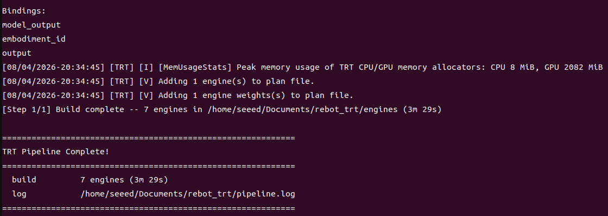
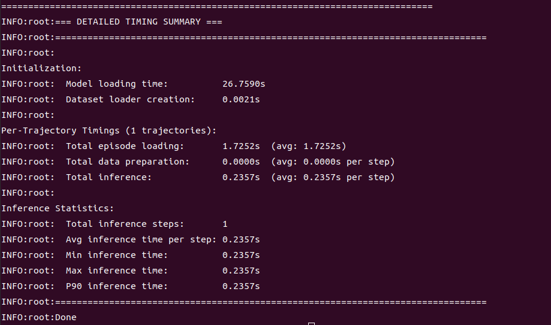
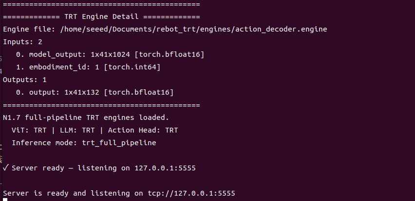
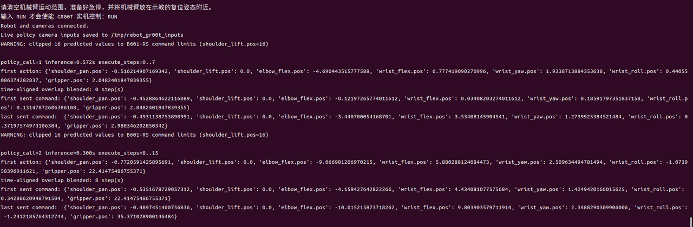

# Run GR00T N1.7 TensorRT Inference on Jetson

## Introduction

This chapter builds and runs the full GR00T N1.7 TensorRT pipeline on Jetson AGX Orin or Jetson AGX Thor. It assumes that JetPack, hardware interfaces, the deployment repository, checkpoint, backbone, and LeRobot dataset were prepared in the preceding chapters.

The workflow is limited to TensorRT export, engine building, offline inference, and policy-server startup. Robot wiring, USB-CAN drivers, camera mapping, dataset conversion, and PyTorch environment setup are documented separately.

## Learning Objectives

- Build a target-specific seven-engine TensorRT bundle.
- Run offline TensorRT inference on Orin and Thor.
- Start the Orin TensorRT policy server.
- Diagnose common engine, runtime, and memory failures.

## Demo Video

- [GR00T N1.7 TensorRT demo](https://seeedstudio.feishu.cn/wiki/JwwnwzFsPi5bFpkU8RscGWOrnWc)


## Prerequisites

```bash
source "${HOME}/.config/gr00t-inference/paths.sh"
cd "${GR00T_REPO}"
git rev-parse HEAD
```

Expected repository revision:

```text
dcf5f6b759fd17cab3644a97fc4429bca7451e38
```

Verify the required inputs:

```bash
test -f "${GR00T_MODEL_PATH}/config.json"
test -f "${GR00T_MODEL_PATH}/processor_config.json"
test -f "${GR00T_MODEL_PATH}/statistics.json"
test -f "${GR00T_DATASET_PATH}/meta/info.json"
test -f "${GR00T_DATASET_PATH}/meta/modality.json"
test -f "${GR00T_BACKBONE_PATH}/config.json"
```

> [!WARNING]
> Never copy TensorRT `.engine` files between Orin and Thor. Engines depend on the GPU architecture, TensorRT version, checkpoint, graph shapes, precision, and builder configuration.

## TensorRT Pipeline Output

The full pipeline creates seven target-specific engines:

```text
1. vit.engine
2. llm_bf16.engine
3. vl_self_attention.engine
4. state_encoder.engine
5. action_encoder.engine
6. dit_bf16.engine
7. action_decoder.engine
```

## Build on Jetson AGX Orin

```bash
export GR00T_TARGET=orin
source "${HOME}/.config/gr00t-inference/paths.sh"
cd "${GR00T_REPO}"

bash scripts/deployment/orin_jp72/run_full_trt.sh prepare
bash scripts/deployment/orin_jp72/run_full_trt.sh verify
bash scripts/deployment/orin_jp72/run_full_trt.sh status
```

*Orin Build Execution Output Log:*



The wrapper activates `.venv-jp72`, loads the JetPack 7.2 CUDA runtime paths, and builds the Orin engine bundle under `${GR00T_TRT_OUTPUT}`.

## Build on Jetson AGX Thor

```bash
export GR00T_TARGET=thor
source "${HOME}/.config/gr00t-inference/paths.sh"
cd "${GR00T_REPO}"

source .venv/bin/activate
source scripts/activate_thor.sh

python scripts/deployment/build_trt_pipeline.py \
  --model-path "${GR00T_MODEL_PATH}" \
  --dataset-path "${GR00T_DATASET_PATH}" \
  --embodiment-tag NEW_EMBODIMENT \
  --output-dir "${GR00T_TRT_OUTPUT}" \
  --precision bf16 \
  --batch-size 1 \
  --steps export,build,verify,benchmark
```

Build a separate Thor output directory even when the checkpoint and dataset are shared with Orin.

## Run Offline Inference on Orin

```bash
export GR00T_TARGET=orin
source "${HOME}/.config/gr00t-inference/paths.sh"
cd "${GR00T_REPO}"

bash scripts/deployment/orin_jp72/run_full_trt.sh evaluate
```

*Orin Offline Evaluation Timing Summary:*



The command evaluates the TensorRT pipeline against the configured local trajectory and writes the result to `${GR00T_RESULT_PATH}`.

## Run Offline Inference on Thor

```bash
export GR00T_TARGET=thor
source "${HOME}/.config/gr00t-inference/paths.sh"
cd "${GR00T_REPO}"

source .venv/bin/activate
source scripts/activate_thor.sh

python scripts/deployment/standalone_inference_script.py \
  --model-path "${GR00T_MODEL_PATH}" \
  --dataset-path "${GR00T_DATASET_PATH}" \
  --embodiment-tag NEW_EMBODIMENT \
  --traj-ids 0 \
  --inference-mode trt_full_pipeline \
  --trt-engine-path "${GR00T_TRT_OUTPUT}/engines" \
  --execution-horizon 16 \
  --save-plot-path "${GR00T_RESULT_PATH}"
```

Use the same embodiment tag and action horizon that were used when exporting the engines.


## Start the Orin TensorRT Policy Server

```bash
export GR00T_TARGET=orin
source "${HOME}/.config/gr00t-inference/paths.sh"
cd "${GR00T_REPO}"

bash scripts/deployment/orin_jp72/run_full_trt.sh serve
```

The default endpoint is `127.0.0.1:5555`.

```bash
ss -ltn | grep ':5555'
```

*Policy Server Listening Output:*



To expose another address:

```bash
export GR00T_SERVER_HOST=0.0.0.0
export GR00T_SERVER_PORT=5555
bash scripts/deployment/orin_jp72/run_full_trt.sh serve
```

A downstream robot client can consume this TensorRT policy endpoint after its own hardware and safety validation.

*Downstream Client Execution Output Log:*



## Validate the Engine Bundle

```bash
find "${GR00T_TRT_OUTPUT}/engines" -maxdepth 1 -name '*.engine' -printf '%f\n' | sort
```

Confirm that all seven engines exist and that verification completed without a shape or numerical-accuracy failure.

## Troubleshooting

### `libcusparseLt.so.0` Cannot Be Found on Orin

Use the wrapper instead of calling `.venv-jp72/bin/python` directly:

```bash
bash scripts/deployment/orin_jp72/run_full_trt.sh evaluate
```

### Wrong Python Environment

```bash
which python
python -c "import sys; print(sys.executable)"
```

- Orin: `${GR00T_REPO}/.venv-jp72/bin/python`
- Thor: `${GR00T_REPO}/.venv/bin/python`

### Engine Shape or Deserialization Error

Delete and rebuild the target-specific engines after changing the checkpoint, backbone, TensorRT version, precision, batch size, action horizon, or graph shapes:

```bash
rm -rf "${GR00T_TRT_OUTPUT}/engines"
```

Then rerun the appropriate Orin or Thor build command.

### TensorRT Build Runs Out of Memory

```bash
free -h
df -h "${GR00T_WORKSPACE}"
sudo tegrastats
```

Close other GPU applications and confirm that the workspace has sufficient free storage before rebuilding.

## Reproduction Checklist

- [ ] The repository is at the validated commit.
- [ ] The checkpoint, backbone, dataset, and embodiment configuration are complete.
- [ ] Orin uses `.venv-jp72`; Thor uses `.venv`.
- [ ] Seven engines were built on the target where they will run.
- [ ] Offline TensorRT inference completes and saves a result plot.
- [ ] The policy server is started only after the engine bundle passes verification.

## References

- [Isaac-GR00T-Orin-JP72 repository](https://github.com/jjjadand/Isaac-GR00T-Orin-JP72)
- [NVIDIA Isaac GR00T](https://github.com/NVIDIA/Isaac-GR00T)
- [NVIDIA Cosmos-Reason2-2B](https://huggingface.co/nvidia/Cosmos-Reason2-2B)
- [Full Orin JetPack 7.2 TensorRT deployment article](https://wiki.seeedstudio.com/deploy_full_weight_gr00t_n1.7_tensorrt_jetpack7.2_agx_orin/)

